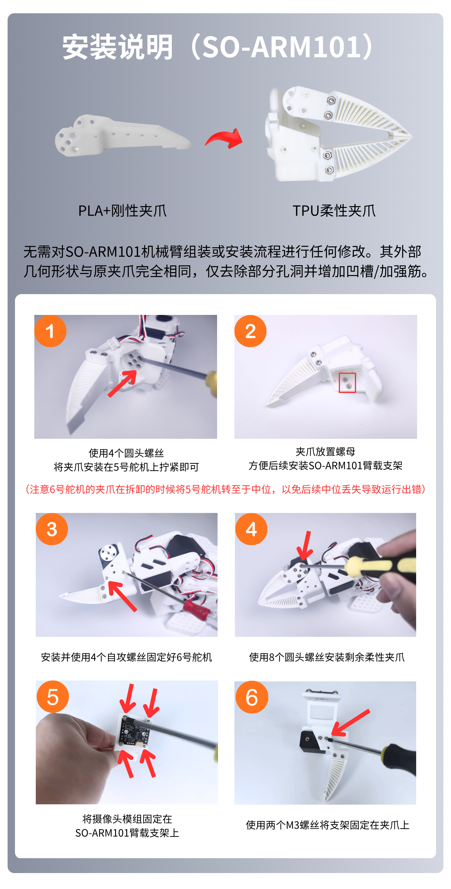

English | [简体中文](../../zh-hans/so-arm101-assembly/arm-mount-and-camera-kit.md) | [繁體中文](../../zh-hant/so-arm101-assembly/arm-mount-and-camera-kit.md) | [Deutsch](../../de/so-arm101-assembly/arm-mount-and-camera-kit.md) | [Español](../../es/so-arm101-assembly/arm-mount-and-camera-kit.md) | [Français](../../fr/so-arm101-assembly/arm-mount-and-camera-kit.md) | [Italiano](../../it/so-arm101-assembly/arm-mount-and-camera-kit.md) | [日本語](../../ja/so-arm101-assembly/arm-mount-and-camera-kit.md) | [한국어](../../ko/so-arm101-assembly/arm-mount-and-camera-kit.md) | [Português (BR)](../../pt-br/so-arm101-assembly/arm-mount-and-camera-kit.md) | [Português (PT)](../../pt-pt/so-arm101-assembly/arm-mount-and-camera-kit.md)

# SO-ARM100&101 Arm-Mounted Bracket and Environment Camera Kit Installation Tutorial

For debugging the USB autofocus camera, refer to this tutorial<cite doc-id="JXstdNbN6oiL1WxiqJrc2OJDnrf" file-type="docx" title="USB Autofocus Camera Tutorial" type="doc"></cite>

## SO-ARM101 Arm-Mounted Bracket Installation Steps

On a pre-assembled unit the nut is usually already installed in the gripper, so you can skip straight to step 2

![The image shows the installation steps for the SO-ARM101 arm-mounted bracket. Step 1 is to detach the SO-ARM101 from the servo at the gripper of the arm and install the M3 nut from the package into the corresponding position on the gripper. Step 2 is to secure the camera module to the SO-ARM101 arm-mounted bracket, taking care with the position of the power cable connector. Step 3 is to fasten the camera module firmly using the M3 screws from the package. Its relation to the surrounding text is that the text mentions the SO-ARM101 arm-mounted bracket installation steps and that on a pre-assembled unit the nut is usually already installed in the gripper so you can skip to step 2; this image shows the detailed installation operations.](../../en/images/d10-01.png)

## Environment Camera Kit Bracket Installation Steps

1. First secure the angle-adjustment bracket

![The image shows a key operation in the environment camera kit bracket installation steps. The left figure (1) is the camera module, the middle figure (2) is the camera module secured to the angle-adjustment bracket, and the right figure (3) is the camera module mounted on the pan-tilt head. The caption says to secure the camera module to the angle-adjustment bracket, tighten it with the two thumbscrews from the package, and mount it on the pan-tilt head. This image corresponds to the "First secure the angle-adjustment bracket" step above and visually presents the operation of securing the camera module.](../../en/images/d10-03.png)

2. Side view of the environment camera kit

3. Top view of the environment camera kit

![The image shows two key operations in the environment camera kit bracket installation steps. In the left image, both hands mount the environment camera kit onto the bracket, aligning the screw hole on the bottom of the camera with the hole on the bracket. In the right image, one hand releases the clip on the bracket while the other hand removes the bracket from the hole on the bottom of the camera. These two images correspond to the "Side view of the environment camera kit" and "Top view of the environment camera kit" steps in the document, visually presenting the specific operations during installation.](../../en/images/d10-05.png)

## Rubber Anti-Slip Pad — Cut It Yourself

![The image shows the rubber anti-slip pad included with the SO-ARM100&101 arm-mounted bracket and environment camera kit. On the left is a close-up of the anti-slip pad, whose surface is textured. On the right is the bracket with the environment camera installed, with a red anti-slip pad beneath the camera. The caption below notes that the anti-slip pad comes as a single sheet and must be cut into individual pieces shaped to fit the gripper, so that it does not come off over time. This image corresponds to the "Rubber anti-slip pad — cut it yourself" section of the document and guides users on how to use the pad correctly.](../../en/images/d10-06.png)
