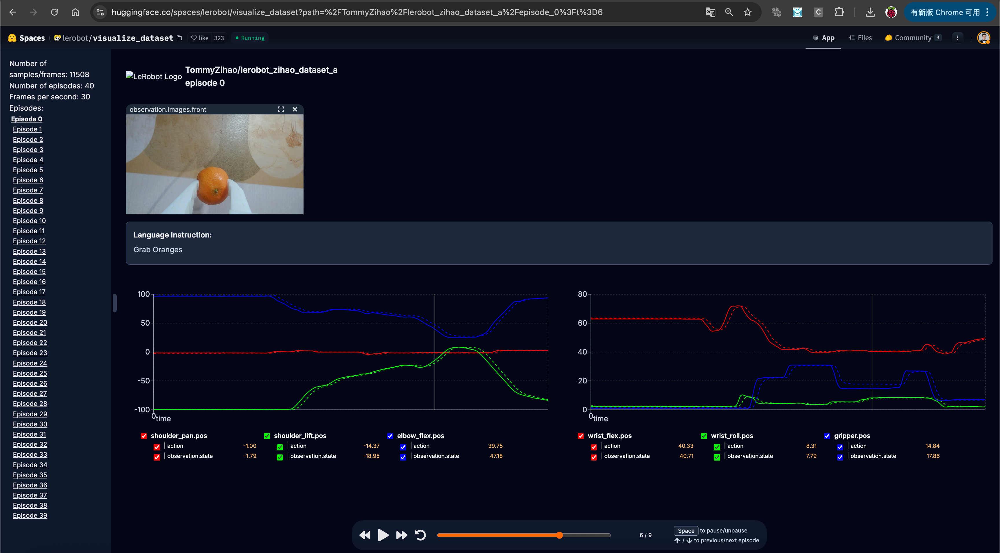

[English](../../en/06-collect-dataset-real/replay-dataset.md) | [简体中文](../../zh-hans/06-collect-dataset-real/replay-dataset.md) | [繁體中文](../../zh-hant/06-collect-dataset-real/replay-dataset.md) | [Deutsch](../../de/06-collect-dataset-real/replay-dataset.md) | Español | [Français](../../fr/06-collect-dataset-real/replay-dataset.md) | [Italiano](../../it/06-collect-dataset-real/replay-dataset.md) | [日本語](../../ja/06-collect-dataset-real/replay-dataset.md) | [한국어](../../ko/06-collect-dataset-real/replay-dataset.md) | [Português (BR)](../../pt-br/06-collect-dataset-real/replay-dataset.md) | [Português (PT)](../../pt-pt/06-collect-dataset-real/replay-dataset.md)

# Ver y reproducir un conjunto de datos

## Visualizar todo el conjunto de datos

https://huggingface.co/spaces/lerobot/visualize_dataset

http://io-ai.tech/lerobot

https://open.platform.io-ai.tech

Introduce `TommyZihao/lerobot_zihao_dataset_a`, u otro conjunto de datos

![La imagen muestra la interfaz del LeRobot Dataset Visualizer, con un robot en la imagen y las palabras "LeRobot Dataset Visualizer" en la parte superior. En el centro hay un menú desplegable que muestra opciones de conjuntos de datos como "TommyZihao/lerobot_zihao_dataset_a", junto con "Example Datasets" y nombres de conjuntos de datos debajo, y un botón azul "Explore Open Datasets" más abajo. Esta imagen se relaciona con la visualización de todo el conjunto de datos mencionada antes y corresponde a la operación de introducir el conjunto de datos especificado.](../../en/images/d39-01.png)




<grid>
<column width-ratio="0.500000">
![La imagen muestra la interfaz de visualización del conjunto de datos grab-orange de LeRobot. En la parte superior hay un vídeo de cómo se agarra una naranja, con la naranja sostenida contra un objeto blanco. Debajo hay gráficos de datos que muestran las curvas de varias variables a lo largo del tiempo, como "actuator", "gripper" y "gripper_pos". A la izquierda hay una lista de instrucciones, con "Grab Orangesanges" seleccionada actualmente. Los botones de reproducir y pausar están en la parte inferior derecha. Esta imagen se relaciona con la visualización de un episodio concreto y presenta visualmente la acción de agarre y sus datos correspondientes.](../../en/images/d39-03.png)
</column>
<column width-ratio="0.500000">

</column>
</grid>

Observación: el comando y el estado no son lo mismo — el comando lo proporciona el brazo Leader y el estado lo proporciona el brazo Follower

## Visualizar un episodio concreto

```Shell
lerobot-dataset-viz --repo-id TommyZihao/lerobot_zihao_dataset_a --episode-index=2
```

![La imagen muestra la interfaz para visualizar un episodio concreto en la plataforma rerun.io. A la izquierda está la estructura del conjunto de datos, que muestra datos como observation_images. En el centro, arriba, está la imagen en vivo de la cámara, con una naranja en la imagen. A la derecha hay curvas de datos que muestran cómo cambian los distintos datos a lo largo del tiempo. En la parte inferior hay una línea de tiempo que se puede arrastrar para ver los datos en cualquier momento. Esta imagen corresponde a "Visualizar un episodio concreto" y presenta visualmente la interfaz y los datos al ver un episodio concreto.](../../en/images/d39-05.png)

Arrastra la línea de tiempo para ver la imagen de la cámara y las posiciones de los servos en cualquier momento

## Reproducir el movimiento del brazo Follower para un episodio concreto

```Shell
lerobot-replay \
    --robot.type=so101_follower \
    --robot.port=/dev/tty.usbmodem5AAF2193061 \
    --robot.id=my_follower_arm \
    --dataset.repo_id=Tommymy/lerobot_my_dataset_a \
    --dataset.episode=2
```

Oirás `Replaying episode` y, a continuación, el brazo Follower se moverá, reproduciendo y recreando el movimiento del episodio especificado

En realidad, a estas alturas ya puedes impresionar a mucha gente, ¿verdad?

<figure view-type="Preview">[Attachment: VID_20260115_140050.mp4](../../en/images/VID_20260115_140050.mp4)</figure>
