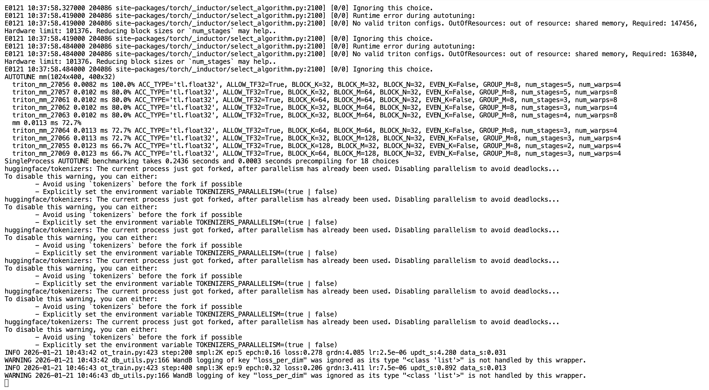

[English](../../en/08-train-model/train-pi05.md) | [简体中文](../../zh-hans/08-train-model/train-pi05.md) | [繁體中文](../../zh-hant/08-train-model/train-pi05.md) | [Deutsch](../../de/08-train-model/train-pi05.md) | [Español](../../es/08-train-model/train-pi05.md) | [Français](../../fr/08-train-model/train-pi05.md) | [Italiano](../../it/08-train-model/train-pi05.md) | 日本語 | [한국어](../../ko/08-train-model/train-pi05.md) | [Português (BR)](../../pt-br/08-train-model/train-pi05.md) | [Português (PT)](../../pt-pt/08-train-model/train-pi05.md)

# 学習コマンドライン - pi0.5

## 参考ドキュメント

https://github.com/huggingface/lerobot/blob/46e19ae579f80ce66211afafd1c3c649c569131f/docs/source/pi0.mdx

https://www.pi.website/blog/pi05

## 推奨するクラウド GPU インスタンス


## 環境のインストール

```Shell
cd lerobot
pip install -e ".[pi0]"
```

## コマンドライン

- 前回中断した学習で output 配下に残ったファイルを削除する

```Shell
sudo rm -rf output_lerobot_train/shake/pi05_A
```

- 学習

```Shell
lerobot-train \
    --dataset.repo_id=Tommymy/lerobot_my_dataset_shake_hands \
    --dataset.root=~/lerobot_my_dataset_shake_hands \
    --dataset.revision=v0.1.0 \
    --policy.type=pi05 \
    --output_dir=~/output_lerobot_train/shake/pi05_A \
    --job_name=shake_pi05_A \
    --policy.pretrained_path=lerobot/pi05_base \
    --policy.compile_model=true \
    --policy.gradient_checkpointing=true \
    --policy.dtype=bfloat16 \
    --policy.freeze_vision_encoder=false \
    --policy.train_expert_only=false \
    --steps=50000 \
    --policy.device=cuda \
    --policy.push_to_hub=false \
    --wandb.enable=true \
    --wandb.project=Lerobot_my_Project \
    --batch_size=8
```

<grid>
<column width-ratio="0.468128">
![この画像は、コマンドラインから身体知能（PI）モデルを学習するときの出力を示しています。モデルがロードされ、パラメーターが再マッピングされ、オプティマイザーとスケジューラーが作成される様子が表示されており、たとえば「Loading model from: lerobot/pi05_base」などがあります。また、「Warning: Could not remap state dicts: ['loading'] in state_dict for PolicyPolicy」のような警告メッセージも表示されています。さらに「num_total_frames: 180K」といった学習関連の数値も示されています。この画像は学習コマンドラインの操作に関連し、学習実行の主要な情報を視覚的に示しています。](../../en/images/fix-03.png)
</column>
<column width-ratio="0.531872">

</column>
</grid>

コマンドラインを実行してから 20 分ほど経つと、ようやく学習が本格的に始まります

モデルのアーカイブは約 5 GB で、解凍すると約 7 GB になります
