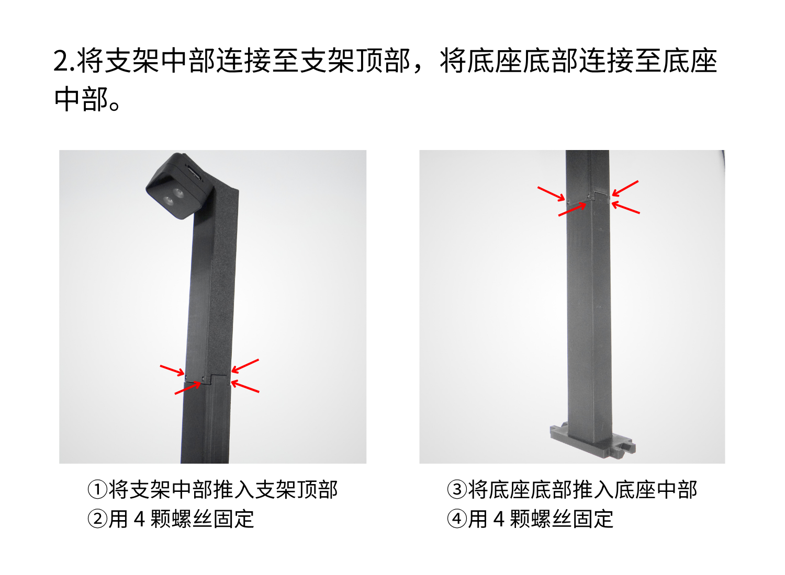

[English](../../en/so-arm101-assembly/overhead-camera-mount.md) | [简体中文](../../zh-hans/so-arm101-assembly/overhead-camera-mount.md) | [繁體中文](../../zh-hant/so-arm101-assembly/overhead-camera-mount.md) | [Deutsch](../../de/so-arm101-assembly/overhead-camera-mount.md) | [Español](../../es/so-arm101-assembly/overhead-camera-mount.md) | [Français](../../fr/so-arm101-assembly/overhead-camera-mount.md) | [Italiano](../../it/so-arm101-assembly/overhead-camera-mount.md) | 日本語 | [한국어](../../ko/so-arm101-assembly/overhead-camera-mount.md) | [Português (BR)](../../pt-br/so-arm101-assembly/overhead-camera-mount.md) | [Português (PT)](../../pt-pt/so-arm101-assembly/overhead-camera-mount.md)

# オーバーヘッドカメラマウントの取り付けチュートリアル

USB オートフォーカスカメラのデバッグについては、こちらのチュートリアルを参照してください<cite doc-id="JXstdNbN6oiL1WxiqJrc2OJDnrf" file-type="docx" title="USB オートフォーカスカメラチュートリアル" type="doc"></cite>

<cite doc-id="OSElwwOmYiVMNTkzo56c40g8nQe" file-type="wiki" title="RealSense D405C チュートリアル" type="doc"></cite>

オーバーヘッドカメラマウントの[公式モデルファイル](https://github.com/TheRobotStudio/SO-ARM100/tree/main/Optional/Overhead_Cam_Mount_Webcam)

