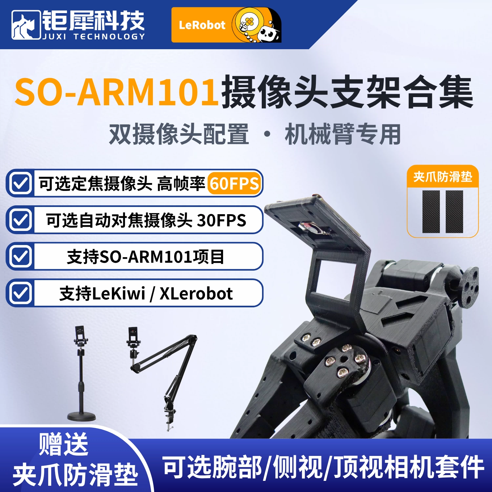
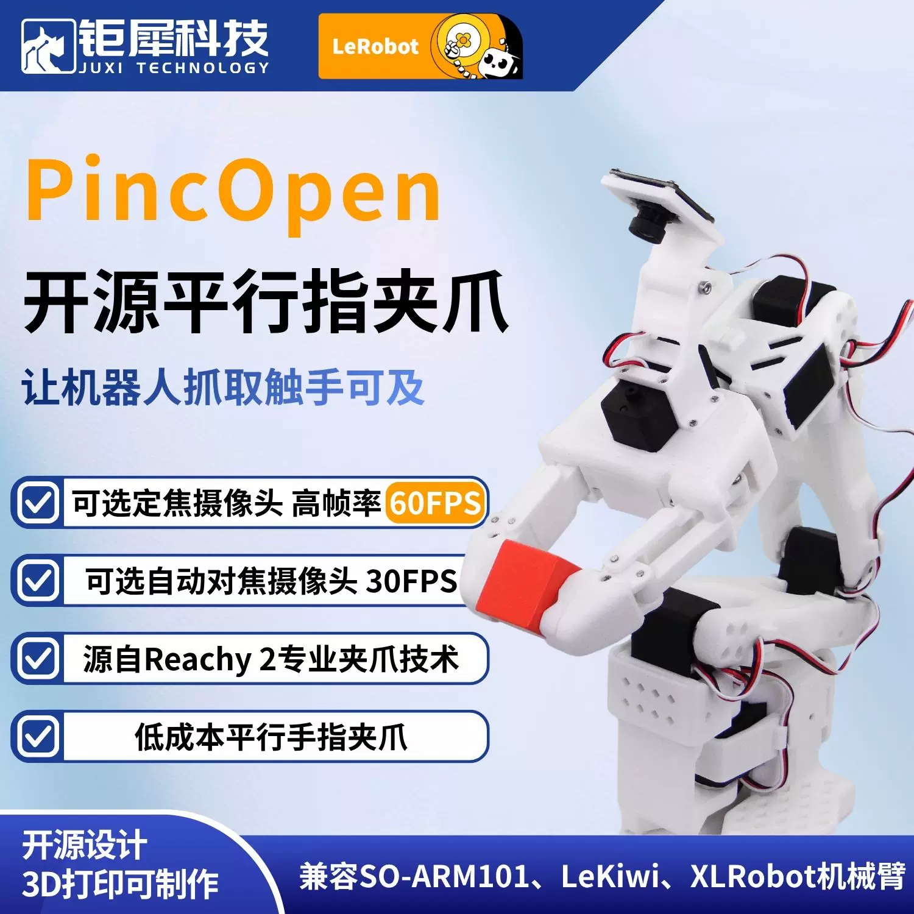
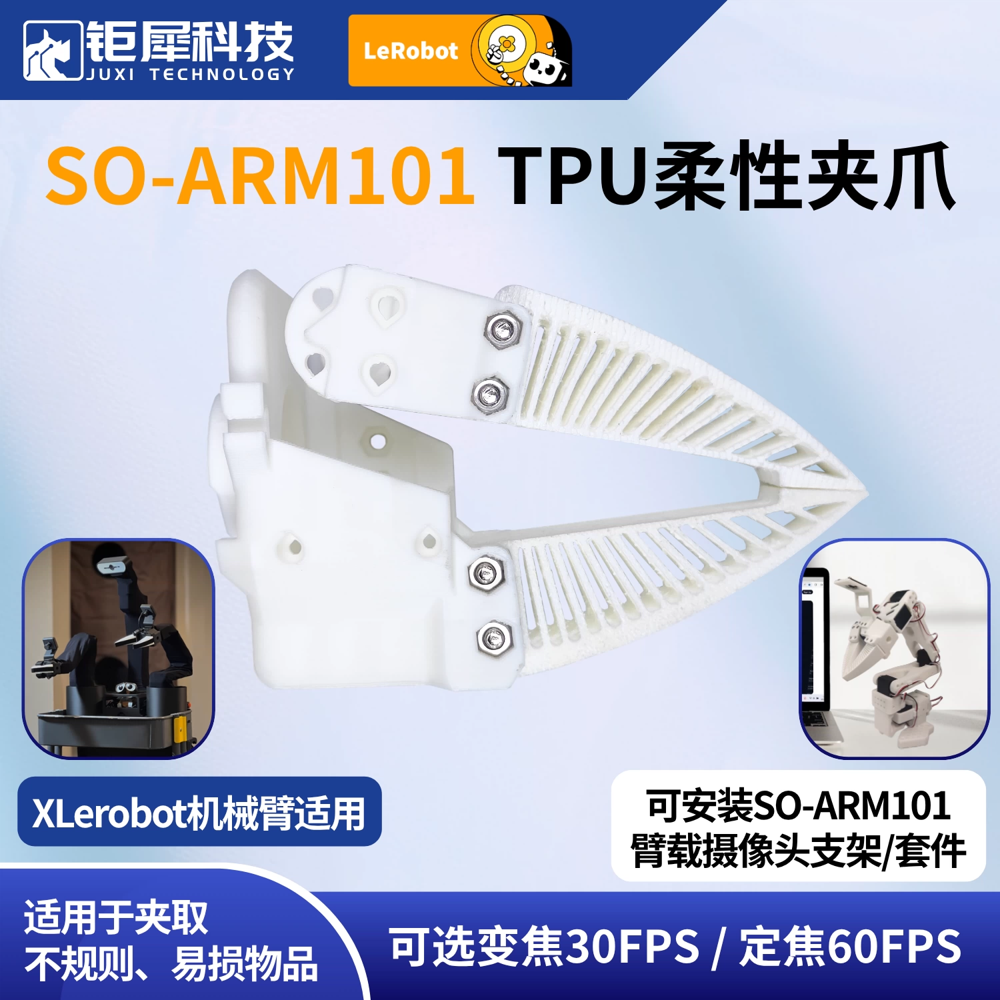
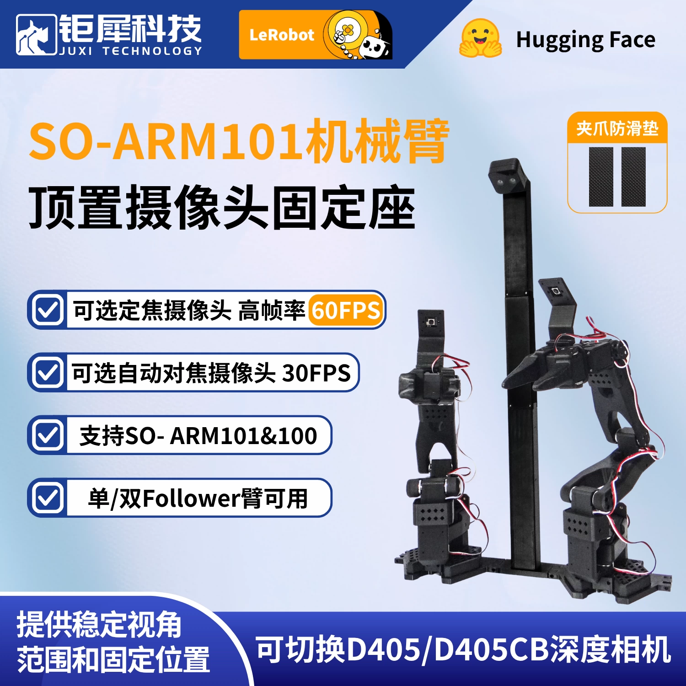
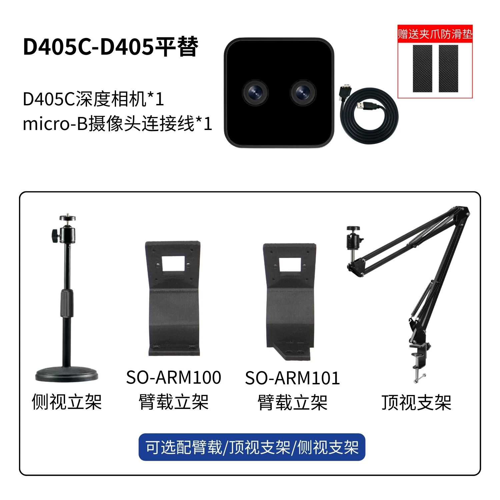

[English](../../en/basics/camera-mounts-recommended.md) | [简体中文](../../zh-hans/basics/camera-mounts-recommended.md) | [繁體中文](../../zh-hant/basics/camera-mounts-recommended.md) | [Deutsch](../../de/basics/camera-mounts-recommended.md) | [Español](../../es/basics/camera-mounts-recommended.md) | [Français](../../fr/basics/camera-mounts-recommended.md) | [Italiano](../../it/basics/camera-mounts-recommended.md) | [日本語](../../ja/basics/camera-mounts-recommended.md) | 한국어 | [Português (BR)](../../pt-br/basics/camera-mounts-recommended.md) | [Português (PT)](../../pt-pt/basics/camera-mounts-recommended.md)

# 권장 카메라 브래킷 및 마운트

SO-ARM101 암 장착 브래킷으로, 30FPS 줌 카메라 모듈 또는 60FPS 고정초점 카메라 모듈 중에서 선택할 수 있습니다

https://item.taobao.com/item.htm?id=912105917442

SO-ARM101 암 평행죠 그리퍼 https://item.taobao.com/item.htm?ft=t&id=1057875884192&spm=a21dvs.23580594.0.0.4fee2c1b38Ma7U

TPU 유연 그리퍼 https://item.taobao.com/item.htm?ft=t&id=1016135072975&spm=a21dvs.23580594.0.0.4fee2c1bqQT5hf

데스크톱 마운트 https://item.taobao.com/item.htm?ft=t&id=987942774005&spm=a21dvs.23580594.0.0.4fee2c1b38Ma7U

SO-ARM101 암 장착 뎁스 카메라 키트

https://item.taobao.com/item.htm?ft=t&id=986234120498&spm=a21dvs.23580594.0.0.4fee2c1b38Ma7U

