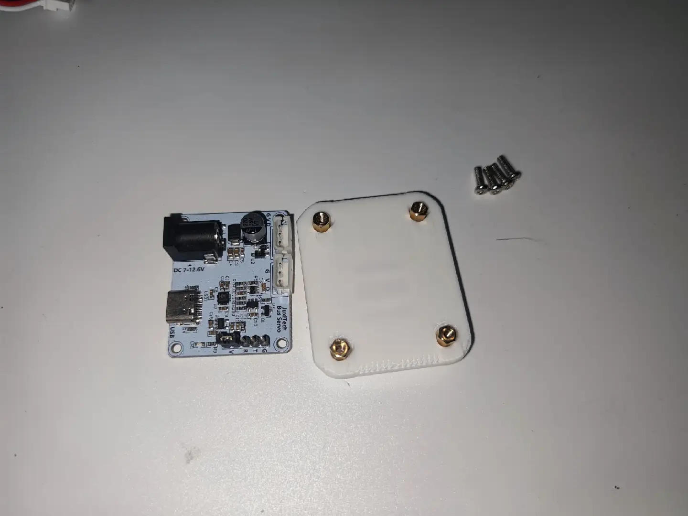
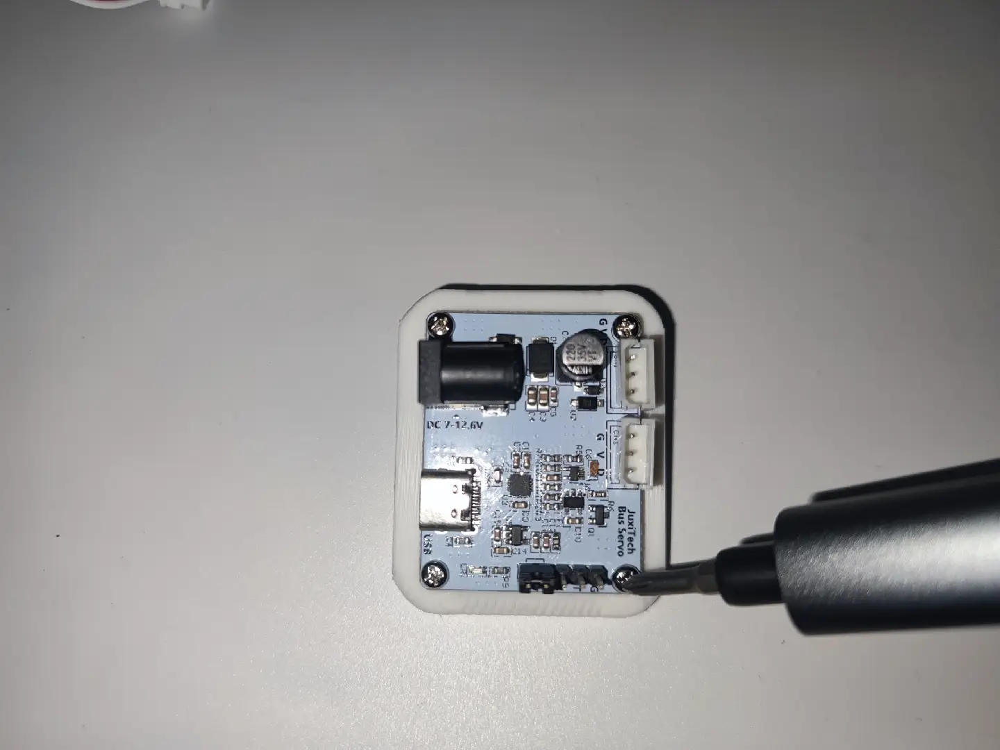
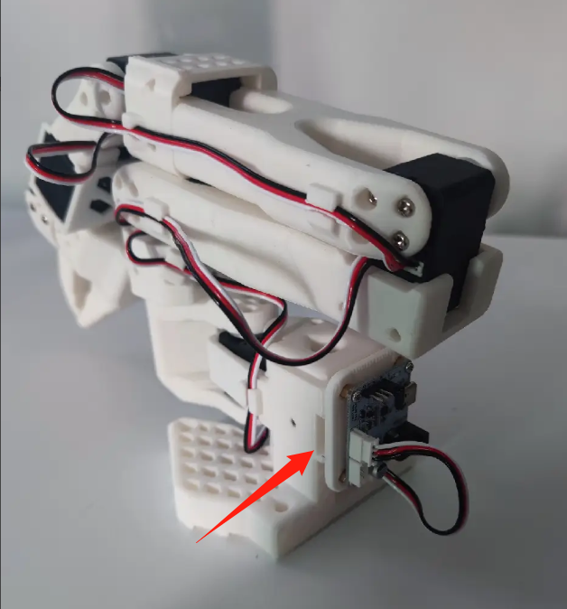

[English](../en/so-arm101-assembly.md) | [简体中文](../zh-hans/so-arm101-assembly.md) | [繁體中文](../zh-hant/so-arm101-assembly.md) | [Deutsch](../de/so-arm101-assembly.md) | [Español](../es/so-arm101-assembly.md) | [Français](../fr/so-arm101-assembly.md) | [Italiano](../it/so-arm101-assembly.md) | [日本語](../ja/so-arm101-assembly.md) | 한국어 | [Português (BR)](../pt-br/so-arm101-assembly.md) | [Português (PT)](../pt-pt/so-arm101-assembly.md)

<title>SO-ARM101 로봇 팔 키트 조립 튜토리얼</title>

<callout emoji="💡">
참고: 조립 완료된 팔이 있다면 이 튜토리얼은 건너뛰십시오
</callout>

## Follower 암의 3D 프린팅 부품


## Leader 암의 3D 프린팅 부품


Leader 암과 Follower 암은 매우 유사하며 끝단만 다릅니다

Leader에는 핸들과 트리거가 있고, Follower에는 그리퍼가 있습니다

## 3D 프린팅 부품의 남은 서포트 제거

모든 구멍, 개구부, 슬롯, 격자를 점검하십시오. 특히 마작의 "오점" 패를 닮은 다섯 개의 구멍을 확인하십시오

이 단계는 매우 중요합니다. 그렇지 않으면 나중에 나사를 조일 수 없습니다

## 네 가지 서보 구분

<table><colgroup><col/><col/><col/><col/><col/><col/></colgroup><tbody><tr><td vertical-align="middle">대형</td><td vertical-align="middle">소형</td><td vertical-align="middle">전압 (V)</td><td vertical-align="middle">감속비</td><td vertical-align="middle">팔 관절</td><td vertical-align="middle">수량</td></tr><tr><td rowspan="4" vertical-align="middle">STS-3215</td><td vertical-align="middle">C001</td><td vertical-align="middle">7.4</td><td vertical-align="middle">1:345</td><td vertical-align="middle">Leader 2</td><td vertical-align="middle">1</td></tr><tr><td vertical-align="middle">C044</td><td vertical-align="middle">7.4</td><td vertical-align="middle">1:191</td><td vertical-align="middle">Leader 1, 3</td><td vertical-align="middle">2</td></tr><tr><td vertical-align="middle">C046</td><td vertical-align="middle">7.4</td><td vertical-align="middle">1:147</td><td vertical-align="middle">Leader 4, 5, 6</td><td vertical-align="middle">3</td></tr><tr><td vertical-align="middle">C047</td><td vertical-align="middle">12</td><td vertical-align="middle">1:345</td><td vertical-align="middle">모든 Follower 관절</td><td vertical-align="middle">6</td></tr></tbody></table>

> 감속비는 "모터 회전 속도 : 서보 출력축 회전 속도"의 비율입니다. 예를 들어 1:345는 출력축이 한 바퀴 회전할 때 모터가 345번 회전한다는 뜻입니다.
> 
> 감속비가 높으면 기어 트레인을 통해 토크가 증폭되므로 더 무거운 하중(예: Follower 암)을 구동할 수 있습니다
> 
> 동시에 출력축은 더 느리게 회전합니다 ("감속"되기 때문입니다)
> 
> 관절을 끄는 데도 더 많은 힘이 듭니다

아래는 이 프로젝트의 모든 서보 모델과 감속비이며, 밑줄이 그어진 부분이 그 번호입니다


## 두 가지 전원 어댑터 구분

5V 6A 30W 전원 어댑터: 7.4V 서보 (Leader 암)에 전원을 공급하며, 검은색입니다

12V 5A 60W 전원 어댑터: 12V 서보 (Follower 암)에 전원을 공급하며, 흰색입니다

## Feetech 서보 디버깅 도구 다운로드

### Windows PC

https://gitee.com/ftservo/fddebug

[`FD1.9.8.5(250729).7z`](https://gitee.com/ftservo/fddebug/blob/master/FD1.9.8.5(250729).7z)를 다운로드하여 압축을 풀고, 그 안의 exe 프로그램을 실행하십시오

### Ubuntu 및 Mac (압축 파일에 튜토리얼이 포함되어 있습니다)

<figure view-type="Card">[Attachment: Juxi_ServoController.zip](../en/images/Juxi_ServoController.zip)</figure>


**프로 버전: Leader 암은 5V6A 전원 어댑터를, Follower 암은 12V5A 전원 어댑터를 사용합니다**

서보 ID 설정, 서보 각도 캘리브레이션, 조립은 사전에 완료해야 합니다. [공식 조립 튜토리얼](https://huggingface.co/docs/lerobot/so101)을 참고하십시오

<sheet sheet-id="kN3ZzK" token="DDCXsU4TCh4wpytxOAkcO9u8nsc"></sheet>

# 1단계: 서보 ID 설정 및 서보 혼 설치 (서보 5 제외)

<grid>
<column width-ratio="0.500000">

</column>
<column width-ratio="0.500000">

</column>
</grid>

1. Feetech 상위 디버깅 도구를 열고 COM 포트를 선택한 뒤, 보드레이트를 백만으로 설정하고 "Open"을 클릭합니다
2. "Search"를 클릭합니다. "STS3215"가 나타나면 "Stop"을 클릭한 다음 "STS3215"를 클릭합니다
3. 상단에서 "Debug"를 선택합니다. 슬라이더를 끌어 서보를 회전시킬 수 있고, "Scan"을 클릭하면 앞뒤로 움직이게 할 수 있습니다. 서보가 정상적으로 동작하는지 확인합니다
4. 상단에서 "Program"을 선택합니다
5. "Center calibration"을 클릭해 서보의 현재 회전축 위치를 중심 (0-4095)으로 설정합니다
6. "ID"를 클릭하고 우측 하단에서 해당 서보의 ID 번호를 설정한 뒤 "Save"를 클릭합니다. 번호는 문자가 아닌 순수 아라비아 숫자입니다
7. 서보와 제어 보드를 연결하는 케이블을 분리합니다
8. 서보 케이블을 서보에 꽂습니다

서보 1에는 두 개의 케이블이 연결됩니다. 나머지 서보에는 지금은 케이블 하나만 연결합니다


<callout emoji="💡">
다시 강조합니다: 각 서보의 관절 ID와 감속비가 **SO-ARM101**과 정확히 일치하는지 확인하십시오.
</callout>

버스 위의 모든 모터는 고유한 ID를 가집니다. 새 모터는 보통 기본 ID `1`로 출고됩니다. 모터와 컨트롤러 간의 통신이 작동하도록 하려면 먼저 각 모터에 고유한 ID를 설정해야 합니다. 또한 버스의 데이터 전송 속도는 보드레이트로 결정됩니다. 서로 통신하려면 컨트롤러와 모든 모터가 동일한 보드레이트로 설정되어야 합니다. 이 팔의 서보는 보드레이트 100000을 사용합니다.

이를 위해 먼저 컨트롤러를 각 모터에 차례로 연결하여 설정할 수 있어야 합니다. 이 파라미터들은 모터 내부 메모리 (EEPROM)의 비휘발성 영역에 기록되므로 한 번만 하면 됩니다.

다른 로봇에서 사용하던 모터를 재사용하는 경우에도 이 단계가 필요할 수 있습니다. ID와 보드레이트가 맞지 않을 수 있기 때문입니다.

아래 동영상은 모터 ID 설정 단계의 순서를 보여줍니다.

## Windows

<figure view-type="Card">[Attachment: 飞特舵机上位机.zip](../en/images/飞特舵机上位机.zip)</figure>

Feetech 서보 상위 도구로 서보 ID를 설정하고 중심을 캘리브레이션하십시오. ID는 1부터 6까지 순서로 설정합니다!

<figure view-type="Preview">[Attachment: 机械臂舵机设置ID-Windows系统.mp4](../en/images/机械臂舵机设置ID-Windows系统.mp4)</figure>

## Linux/Ubuntu 및 Mac

<callout emoji="💡">
Feetech 서보 상위 도구가 필요하면 위의 [Feetech 서보 디버깅 도구](https://juxitech.feishu.cn/wiki/HllBwhjJ1iayMdkUTGgcyKbgn8g#share-Jvk1dRRl8oY0Skxrt2VczA9jnNb)를 참고하십시오
</callout>

먼저 [공식 LeRobot 설치](https://huggingface.co/docs/lerobot/installation) 페이지에 따라 환경 설정을 완료하십시오

<callout emoji="💡">
가상 환경을 활성화하고 해당 src/lerobot 디렉터리로 이동하는 것을 잊지 마십시오
conda activate lerobot
cd lerobot/src/lerobot
</callout>

1. 팔의 USB 포트를 찾습니다. 각 팔에 맞는 올바른 포트를 찾으려면 유틸리티 스크립트를 두 번 실행하십시오::

```Plain Text
lerobot-find-port
```

Leader 암 포트를 식별할 때의 출력 예시 (예를 들어 Mac에서는 `/dev/tty.usbmodem575E0031751`, Linux에서는 `/dev/ttyACM0`일 수 있습니다):

```PowerShell
Finding all available ports for the MotorBus.
['/dev/ttyACM0', '/dev/ttyACM1']
Remove the usb cable from your MotorsBus and press Enter when done.

[...Disconnect corresponding leader or follower arm and press Enter...]

The port of this MotorsBus is /dev/ttyACM1
Reconnect the USB cable.
```

Follower 암 포트를 식별할 때의 출력 예시 (예를 들어 `/dev/tty.usbmodem575E0032081`, Linux에서는 `/dev/ttyACM1`일 수 있습니다):

```PowerShell
Finding all available ports for the MotorBus.
['/dev/ttyACM0', '/dev/ttyACM1']
Remove the usb cable from your MotorsBus and press Enter when done.

[...Disconnect corresponding leader or follower arm and press Enter...]

The port of this MotorsBus is /dev/ttyACM0
Reconnect the USB cable.
```

<callout emoji="💡">
USB 커넥터를 뽑는 것을 잊지 마십시오. 그렇지 않으면 포트를 감지할 수 없습니다.
</callout>

2. USB 케이블로 PC를 Follower 암의 서보 드라이버 보드에 연결하고 전원을 켭니다. 그런 다음 다음 명령을 실행합니다. 명령의 --robot.port=/dev/ttyACM0을 찾은 포트로 변경하십시오. 예를 들어 찾은 포트가 /dev/ttyACM1이면 --robot.port=/dev/ttyACM1로 변경하십시오

```Python
lerobot-setup-motors \
    --robot.type=so101_follower \
    --robot.port=/dev/ttyACM0
```

다음과 같은 출력이 표시됩니다.

```Python
Connect the controller board to the 'gripper' motor only and press enter.
```

안내에 따라 그리퍼 서보를 연결합니다. 서보 드라이버 보드에 연결된 서보가 이것 하나뿐이고, 이 서보가 아직 다른 서보에 연결되지 않았는지 확인하십시오. **[Enter]** 를 누르면 스크립트가 해당 서보의 ID와 보드레이트를 자동으로 설정합니다. ID는 6부터 1까지 순서로 설정됩니다!

그러면 다음과 같은 출력이 표시됩니다:

```Python
'gripper' motor id set to 6
```

다음 출력은 다음과 같습니다:

```Python
Connect the controller board to the 'wrist_roll' motor only and press enter.
```

<callout emoji="❗">
**참고** 각 서보에 대해 위 과정을 안내에 따라 반복하십시오.
이전 서보들과 마찬가지로, 드라이버 보드에 연결된 서보가 이것 하나뿐이고 서보 자체가 다른 서보에 연결되지 않았는지 확인하십시오.
</callout>

매번 **Enter** 를 누르기 전에 케이블 연결을 반드시 확인하십시오. 예를 들어 회로 기판을 다루는 동안 전원 케이블이 느슨해질 수 있습니다.

모든 단계를 완료하면 스크립트가 자동으로 종료되고 서보를 사용할 준비가 됩니다. 이제 각 서보의 3핀 커넥터를 차례로 연결하고, 첫 번째 서보 (ID 1의 "shoulder pan" 서보)의 케이블을 드라이버 보드에 연결할 수 있습니다. 이제 드라이버 보드를 팔의 베이스에 장착할 수 있습니다.

Leader 암에 대해서도 동일한 단계를 반복하십시오.

```Python
lerobot-setup-motors \
    --teleop.type=so101_leader \
    --teleop.port=/dev/ttyACM0
```

<figure view-type="Preview">[Attachment: 机械臂舵机设置ID-Linux系统.mp4](../en/images/机械臂舵机设置ID-Linux系统.mp4)</figure>

# 2단계: 조립

<callout emoji="💡">
- Follower 암의 조립 단계는 Leader 암과 본질적으로 동일합니다. 유일한 차이는 12단계 이후 엔드이펙터 (그리퍼와 핸들)를 다르게 설치한다는 점입니다.
</callout>

<figure view-type="Preview">[Attachment: SO-ARM101机械臂组装教程.mp4](../en/images/SO-ARM101机械臂组装教程.mp4)</figure>

<callout emoji="💡">
서보 드라이버 보드 설치: 먼저 4개의 황동 스탠드오프를 장착한 뒤, 4개의 M2.5\*8 나사로 드라이버 보드를 고정하십시오
</callout>

<grid>
<column width-ratio="0.525947">

</column>
<column width-ratio="0.474053">

</column>
</grid>



**프로 버전: 검은색 Leader 암은 5V6A 전원 어댑터를, 흰색 Follower 암은 12V5A 전원 어댑터를 사용합니다**


# 웹 UI에서 서보 ID 설정 및 중심 캘리브레이션

https://bambot.org/feetech.js?lang=zh

1. 서보 모델에 따라 0 또는 1을 입력한 뒤 "Connect"를 클릭합니다


2. ID 1\~6의 서보를 스캔합니다. 스캔 결과에서 FOUND를 사용해 해당 ID 서보를 확인합니다. 예를 들어 이미지에서는 서보 ID 1이 발견되었습니다


3. ID 설정 및 중심 캘리브레이션

① 현재 서보 ID 입력란을 스캔한 서보의 ID로 설정합니다

② "ID management"에 숫자를 입력하고 "Change ID"를 클릭해 ID를 설정합니다

③ 중심 캘리브레이션 (STS3215 서보의 중심은 2047, SCS0009 서보의 중심은 511입니다)

STS 서보: "Position control"에 2047을 입력하고 "Set"을 클릭합니다

SCS 서보: "Position control"에 511을 입력하고 "Set"을 클릭합니다


