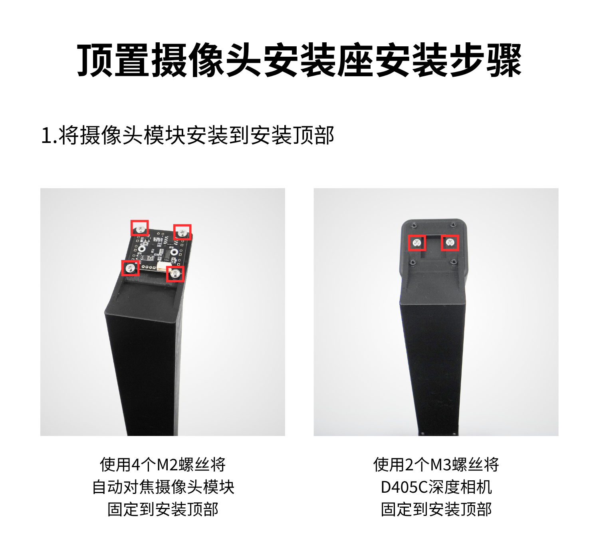

[English](../../en/so-arm101-assembly/overhead-camera-mount.md) | [简体中文](../../zh-hans/so-arm101-assembly/overhead-camera-mount.md) | [繁體中文](../../zh-hant/so-arm101-assembly/overhead-camera-mount.md) | [Deutsch](../../de/so-arm101-assembly/overhead-camera-mount.md) | [Español](../../es/so-arm101-assembly/overhead-camera-mount.md) | [Français](../../fr/so-arm101-assembly/overhead-camera-mount.md) | [Italiano](../../it/so-arm101-assembly/overhead-camera-mount.md) | [日本語](../../ja/so-arm101-assembly/overhead-camera-mount.md) | 한국어 | [Português (BR)](../../pt-br/so-arm101-assembly/overhead-camera-mount.md) | [Português (PT)](../../pt-pt/so-arm101-assembly/overhead-camera-mount.md)

# 천장 카메라 마운트 설치 튜토리얼

USB 오토포커스 카메라 디버깅에 대해서는 이 튜토리얼을 참고하십시오<cite doc-id="JXstdNbN6oiL1WxiqJrc2OJDnrf" file-type="docx" title="USB 오토포커스 카메라 튜토리얼" type="doc"></cite>

<cite doc-id="OSElwwOmYiVMNTkzo56c40g8nQe" file-type="wiki" title="RealSense D405C 튜토리얼" type="doc"></cite>

천장 카메라 마운트 [공식 모델 파일](https://github.com/TheRobotStudio/SO-ARM100/tree/main/Optional/Overhead_Cam_Mount_Webcam)

