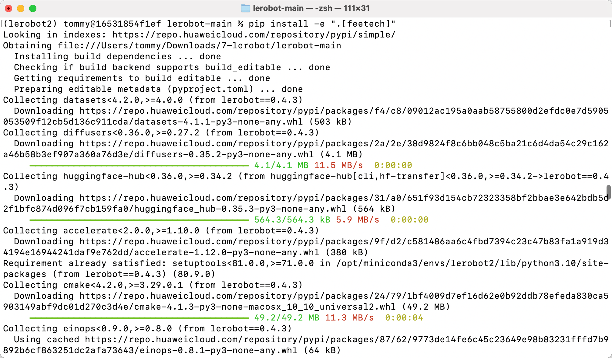
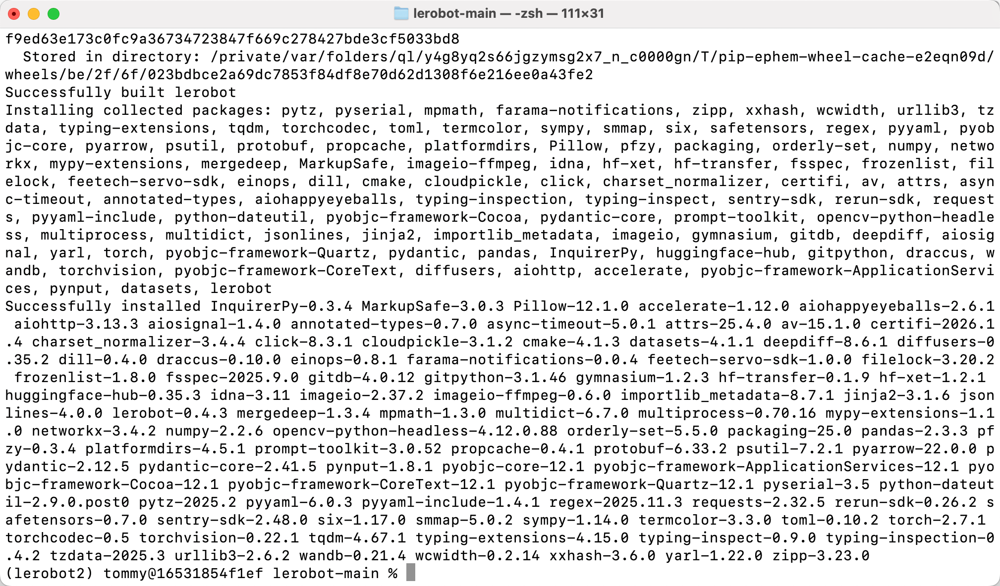

[English](../../en/01-install-lerobot/mac.md) | 简体中文 | [繁體中文](../../zh-hant/01-install-lerobot/mac.md) | [Deutsch](../../de/01-install-lerobot/mac.md) | [Español](../../es/01-install-lerobot/mac.md) | [Français](../../fr/01-install-lerobot/mac.md) | [Italiano](../../it/01-install-lerobot/mac.md) | [日本語](../../ja/01-install-lerobot/mac.md) | [한국어](../../ko/01-install-lerobot/mac.md) | [Português (BR)](../../pt-br/01-install-lerobot/mac.md) | [Português (PT)](../../pt-pt/01-install-lerobot/mac.md)

# MAC电脑

黑色主动臂使用 5V6A 电源适配器

白色从动臂使用 12V5A 电源适配器

## 加权限


## 安装Miniconda

https://www.anaconda.com/download

## pip换源

```Shell
pip config set global.index-url https://mirrors.aliyun.com/pypi/simple
```

## conda换源

```Shell
# 清空原有 .condarc 配置（可选，避免冲突）
echo "" > ~/.condarc

# 写入清华源配置
cat << EOF > ~/.condarc
channels:
  - defaults
show_channel_urls: true
default_channels:
  - https://mirrors.tuna.tsinghua.edu.cn/anaconda/pkgs/main
  - https://mirrors.tuna.tsinghua.edu.cn/anaconda/pkgs/r
  - https://mirrors.tuna.tsinghua.edu.cn/anaconda/pkgs/msys2
custom_channels:
  conda-forge: https://mirrors.tuna.tsinghua.edu.cn/anaconda/cloud
  msys2: https://mirrors.tuna.tsinghua.edu.cn/anaconda/cloud
  bioconda: https://mirrors.tuna.tsinghua.edu.cn/anaconda/cloud
  menpo: https://mirrors.tuna.tsinghua.edu.cn/anaconda/cloud
  pytorch: https://mirrors.tuna.tsinghua.edu.cn/anaconda/cloud
  pytorch-lts: https://mirrors.tuna.tsinghua.edu.cn/anaconda/cloud
  simpleitk: https://mirrors.tuna.tsinghua.edu.cn/anaconda/cloud
EOF

# 清除缓存使配置生效
conda clean -i
```

## 创建虚拟环境

```Shell
conda create -y -n lerobot python=3.12
```

## 进入虚拟环境

```Shell
conda activate lerobot
```

## 安装ffmpeg

```Shell
conda install ffmpeg=7.1.1 -c conda-forge -y
```

验证安装成功

```Shell
ffmpeg
```


## 下载LeRobot

- 下载LeRobot官方代码库

```Shell
git clone https://github.com/huggingface/lerobot.git
```

## 安装代码仓库

```Shell
# cd lerobot-main
cd lerobot
pip install -e ".[feetech]"
```

<grid>
<column width-ratio="0.500000">

</column>
<column width-ratio="0.500000">

</column>
</grid>

## 验证安装成功

```Shell
lerobot-info

python

import lerobot
import torch
torch.cuda.is_available()
import scservo_sdk
```


