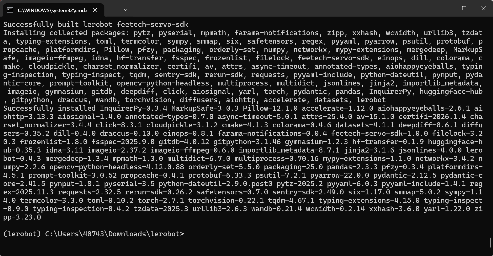

[English](../../en/01-install-lerobot/windows.md) | 简体中文 | [繁體中文](../../zh-hant/01-install-lerobot/windows.md) | [Deutsch](../../de/01-install-lerobot/windows.md) | [Español](../../es/01-install-lerobot/windows.md) | [Français](../../fr/01-install-lerobot/windows.md) | [Italiano](../../it/01-install-lerobot/windows.md) | [日本語](../../ja/01-install-lerobot/windows.md) | [한국어](../../ko/01-install-lerobot/windows.md) | [Português (BR)](../../pt-br/01-install-lerobot/windows.md) | [Português (PT)](../../pt-pt/01-install-lerobot/windows.md)

# Windows电脑

黑色主动臂使用 5V6A 电源适配器

白色从动臂使用 12V5A 电源适配器

## 安装Miniconda

anaconda.com/download/success

或者直接点这个链接下载安装包

https://repo.anaconda.com/miniconda/Miniconda3-latest-Windows-x86_64.exe

<grid>
<column width-ratio="0.500000">

</column>
<column width-ratio="0.500000">

</column>
</grid>

## conda换源

```Shell
# 先清空原有源配置（避免冲突）
conda config --remove-key channels

# 将 conda 的默认源和常用第三方源替换为清华镜像
# 添加默认包源（main/r/msys2）
conda config --add channels https://mirrors.tuna.tsinghua.edu.cn/anaconda/pkgs/main/
conda config --add channels https://mirrors.tuna.tsinghua.edu.cn/anaconda/pkgs/r/
conda config --add channels https://mirrors.tuna.tsinghua.edu.cn/anaconda/pkgs/msys2/

# 添加常用第三方源
conda config --add channels https://mirrors.tuna.tsinghua.edu.cn/anaconda/cloud/conda-forge/
conda config --add channels https://mirrors.tuna.tsinghua.edu.cn/anaconda/cloud/msys2/
conda config --add channels https://mirrors.tuna.tsinghua.edu.cn/anaconda/cloud/bioconda/
conda config --add channels https://mirrors.tuna.tsinghua.edu.cn/anaconda/cloud/menpo/
conda config --add channels https://mirrors.tuna.tsinghua.edu.cn/anaconda/cloud/pytorch/

# 开启显示下载源，安装包时会显示具体的下载地址
conda config --set show_channel_urls yes

# 清除索引缓存，使新源生效
conda clean -i

# 查看当前配置（验证源是否添加成功）
conda config --show-sources
```

## 创建虚拟环境

```Shell
conda create -y -n lerobot python=3.12
```

## 激活虚拟环境

```Shell
conda activate lerobot
```

## 安装ffmpeg

```Shell
conda install ffmpeg=7.1.1 -c conda-forge -y
```

验证安装成功

```Shell
ffmpeg
```


<grid>
<column width-ratio="0.568354">

</column>
<column width-ratio="0.431646">

</column>
</grid>

## 下载LeRobot

- 下载LeRobot官方代码库

```Shell
git clone https://github.com/huggingface/lerobot.git
```

## 安装代码仓库

```Shell
cd lerobot
```

```Plain Text
pip install -e ".[feetech]"
```



## 验证安装成功

```Shell
python

import lerobot
import scservo_sdk
import torch
torch.cuda.is_available()
```

