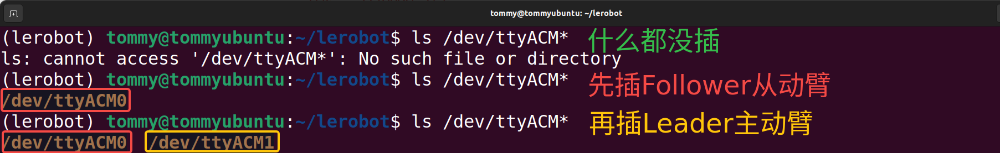

[English](../../en/02-find-serial-port/ubuntu.md) | 简体中文 | [繁體中文](../../zh-hant/02-find-serial-port/ubuntu.md) | [Deutsch](../../de/02-find-serial-port/ubuntu.md) | [Español](../../es/02-find-serial-port/ubuntu.md) | [Français](../../fr/02-find-serial-port/ubuntu.md) | [Italiano](../../it/02-find-serial-port/ubuntu.md) | [日本語](../../ja/02-find-serial-port/ubuntu.md) | [한국어](../../ko/02-find-serial-port/ubuntu.md) | [Português (BR)](../../pt-br/02-find-serial-port/ubuntu.md) | [Português (PT)](../../pt-pt/02-find-serial-port/ubuntu.md)

<title>Ubuntu</title>

# 方法一：Linux命令行直接查看

## 查看串口设备端口

```Shell
ls /dev/ttyACM*
```

## 连接电脑和机械臂的USB口

先插上Follower从动臂，再继续插上Leader主动臂



# 方法二：Lerobot官方工具

```Shell
lerobot-find-port
```


# 记录我的端口

`/dev/ttyACM0`为Follower从动臂的串口设备端口号

`/dev/ttyACM1`为Leader主动臂的串口设备端口号

# 给端口赋予权限

让所有用户都有权限读写这些串口设备

```Shell
sudo chmod 666 /dev/ttyACM*
```