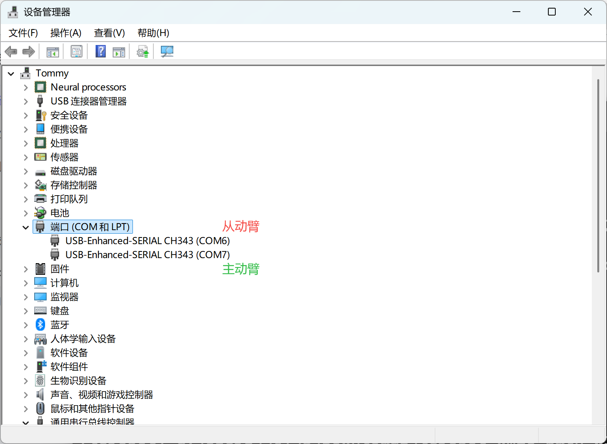

[English](../../en/02-find-serial-port/windows.md) | 简体中文 | [繁體中文](../../zh-hant/02-find-serial-port/windows.md) | [Deutsch](../../de/02-find-serial-port/windows.md) | [Español](../../es/02-find-serial-port/windows.md) | [Français](../../fr/02-find-serial-port/windows.md) | [Italiano](../../it/02-find-serial-port/windows.md) | [日本語](../../ja/02-find-serial-port/windows.md) | [한국어](../../ko/02-find-serial-port/windows.md) | [Português (BR)](../../pt-br/02-find-serial-port/windows.md) | [Português (PT)](../../pt-pt/02-find-serial-port/windows.md)

# Windows电脑

打开`设备管理器`，先插上`从动臂`，再插上`主动臂`，查看对应的COM口编号

## 记录我的端口号

从动臂：

COM6

主动臂：

COM7