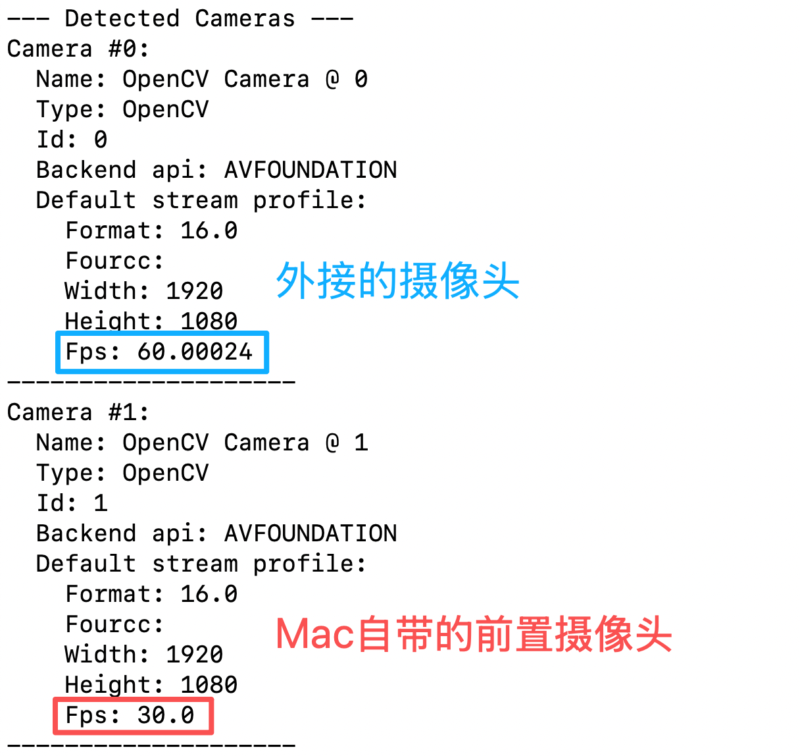
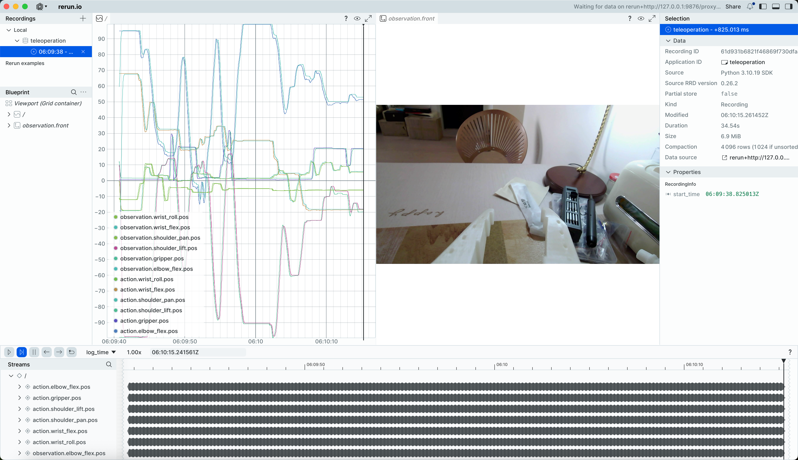
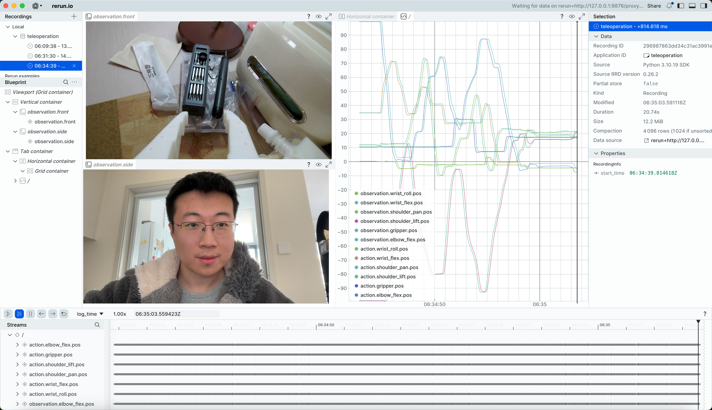

[English](../../en/05-teleoperation-with-camera/mac.md) | 简体中文 | [繁體中文](../../zh-hant/05-teleoperation-with-camera/mac.md) | [Deutsch](../../de/05-teleoperation-with-camera/mac.md) | [Español](../../es/05-teleoperation-with-camera/mac.md) | [Français](../../fr/05-teleoperation-with-camera/mac.md) | [Italiano](../../it/05-teleoperation-with-camera/mac.md) | [日本語](../../ja/05-teleoperation-with-camera/mac.md) | [한국어](../../ko/05-teleoperation-with-camera/mac.md) | [Português (BR)](../../pt-br/05-teleoperation-with-camera/mac.md) | [Português (PT)](../../pt-pt/05-teleoperation-with-camera/mac.md)

# Mac电脑

## 连接摄像头和电脑

```Shell
lerobot-find-cameras opencv
```



## 一个摄像头，遥操作并显示摄像头画面

```Shell
lerobot-teleoperate \
    --robot.type=so101_follower \
    --robot.port=/dev/tty.usbmodem5AAF2193061 \
    --robot.id=my_follower_arm \
    --robot.cameras="{ front: {type: opencv, index_or_path: 0, width: 1920, height: 1080, fps: 60, fourcc: "MJPG"}}" \
    --teleop.type=so101_leader \
    --teleop.port=/dev/tty.usbmodem5AAF2194741 \
    --teleop.id=my_leader_arm \
    --display_data=true
```

运行后启动遥操作

会打开rerun.io画面，实时显示各个舵机关节的轨迹，以及摄像头实时画面

并保存图像至`~/用户名/outputs/captured_images`目录



## 多个摄像头，遥操作并显示摄像头画面

```Shell
lerobot-teleoperate \
    --robot.type=so101_follower \
    --robot.port=/dev/tty.usbmodem5AAF2193061 \
    --robot.id=my_follower_arm \
    --robot.cameras="{ front: {type: opencv, index_or_path: 0, width: 1920, height: 1080, fps: 60, fourcc: "MJPG"}, side: {type: opencv, index_or_path: 1, width: 1920, height: 1080, fps: 30, fourcc: "MJPG"}}" \
    --teleop.type=so101_leader \
    --teleop.port=/dev/tty.usbmodem5AAF2194741 \
    --teleop.id=my_leader_arm \
    --display_data=true
```

