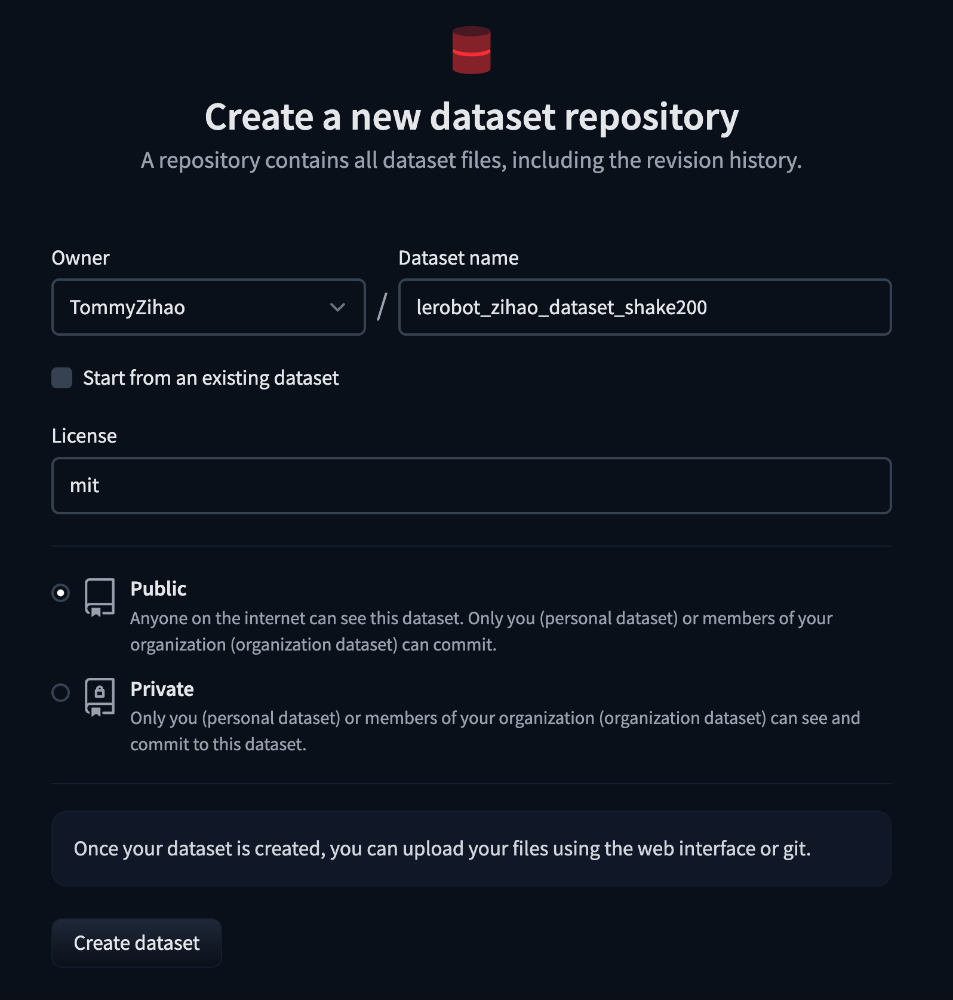

[English](../../en/06-collect-dataset-real/collect-dataset-handshake-200.md) | 简体中文 | [繁體中文](../../zh-hant/06-collect-dataset-real/collect-dataset-handshake-200.md) | [Deutsch](../../de/06-collect-dataset-real/collect-dataset-handshake-200.md) | [Español](../../es/06-collect-dataset-real/collect-dataset-handshake-200.md) | [Français](../../fr/06-collect-dataset-real/collect-dataset-handshake-200.md) | [Italiano](../../it/06-collect-dataset-real/collect-dataset-handshake-200.md) | [日本語](../../ja/06-collect-dataset-real/collect-dataset-handshake-200.md) | [한국어](../../ko/06-collect-dataset-real/collect-dataset-handshake-200.md) | [Português (BR)](../../pt-br/06-collect-dataset-real/collect-dataset-handshake-200.md) | [Português (PT)](../../pt-pt/06-collect-dataset-real/collect-dataset-handshake-200.md)

# 示教采集数据集-握手200

## 在HuggingFace上创建Dataset Repo

https://huggingface.co/new-dataset



## 删除之前已经有的同名数据集（如果有）

```Shell
sudo rm -rf /Users/tommy/.cache/huggingface/lerobot/Tommymy/lerobot_my_dataset_shake200
```

## Shake200数据集采集

一个摄像头，采集数据集-Mac电脑

```Shell
lerobot-record \
    --robot.type=so101_follower \
    --robot.port=/dev/tty.usbmodem5AAF2193061 \
    --robot.id=my_follower_arm \
    --robot.cameras="{ front: {type: opencv, index_or_path: 0, width: 1920, height: 1080, fps: 60, fourcc: "MJPG"}}" \
    --teleop.type=so101_leader \
    --teleop.port=/dev/tty.usbmodem5AAF2194741 \
    --teleop.id=my_leader_arm \
    --display_data=true \
    --dataset.repo_id=Tommymy/lerobot_my_dataset_shake200 \
    --dataset.num_episodes=200 \
    --dataset.single_task="Shanke Hands" \
    --dataset.push_to_hub=false \
    --dataset.episode_time_s=12 \
    --dataset.reset_time_s=1
```

## 采集中

<grid>
<column width-ratio="0.508765">

</column>
<column width-ratio="0.491235">

</column>
</grid>

键盘方向键操作：  
→（右箭头）提前终止当前episode；进入下一个episode。  
←（左箭头）取消当前episode；重新录制。  
ESC，立即停止，编码视频，并上传数据集。

## 采集完毕，数据集保存目录

```Shell
/Users/tommy/.cache/huggingface/lerobot/Tommymy/lerobot_my_dataset_shake200
```