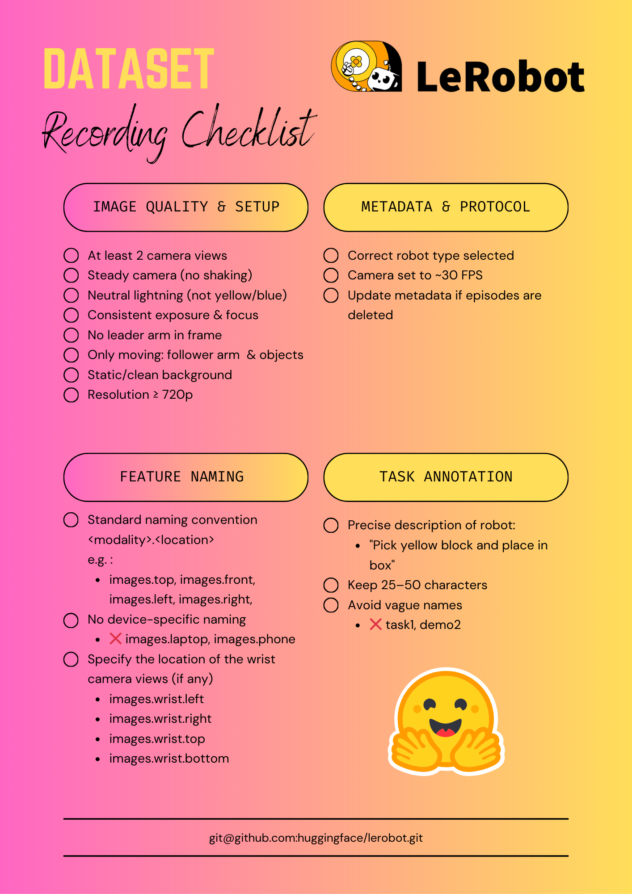

[English](../../en/06-collect-dataset-real/collection-notes.md) | 简体中文 | [繁體中文](../../zh-hant/06-collect-dataset-real/collection-notes.md) | [Deutsch](../../de/06-collect-dataset-real/collection-notes.md) | [Español](../../es/06-collect-dataset-real/collection-notes.md) | [Français](../../fr/06-collect-dataset-real/collection-notes.md) | [Italiano](../../it/06-collect-dataset-real/collection-notes.md) | [日本語](../../ja/06-collect-dataset-real/collection-notes.md) | [한국어](../../ko/06-collect-dataset-real/collection-notes.md) | [Português (BR)](../../pt-br/06-collect-dataset-real/collection-notes.md) | [Português (PT)](../../pt-pt/06-collect-dataset-real/collection-notes.md)

# 采集数据集注意事项

https://huggingface.co/blog/lerobot-datasets#what-makes-a-good-dataset

主动臂不应出现在画面中

