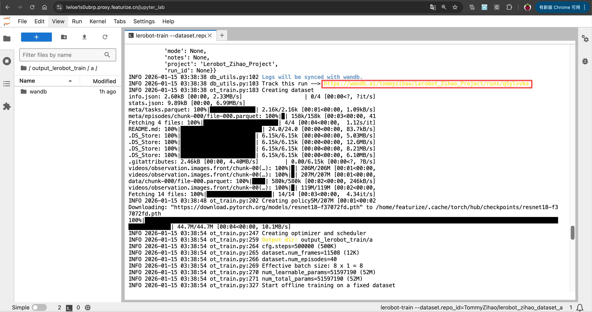
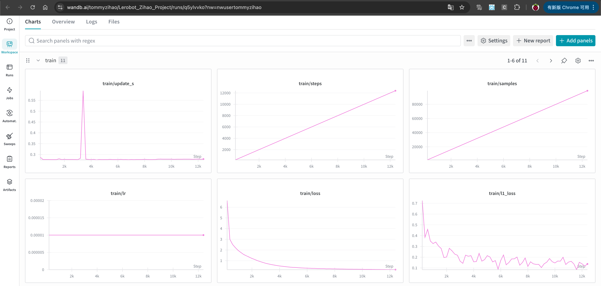

[English](../../en/08-train-model/wandb-training-curves.md) | 简体中文 | [繁體中文](../../zh-hant/08-train-model/wandb-training-curves.md) | [Deutsch](../../de/08-train-model/wandb-training-curves.md) | [Español](../../es/08-train-model/wandb-training-curves.md) | [Français](../../fr/08-train-model/wandb-training-curves.md) | [Italiano](../../it/08-train-model/wandb-training-curves.md) | [日本語](../../ja/08-train-model/wandb-training-curves.md) | [한국어](../../ko/08-train-model/wandb-training-curves.md) | [Português (BR)](../../pt-br/08-train-model/wandb-training-curves.md) | [Português (PT)](../../pt-pt/08-train-model/wandb-training-curves.md)

# wandb查看实时训练曲线

- 获取wandb链接

- 查看训练实时曲线

