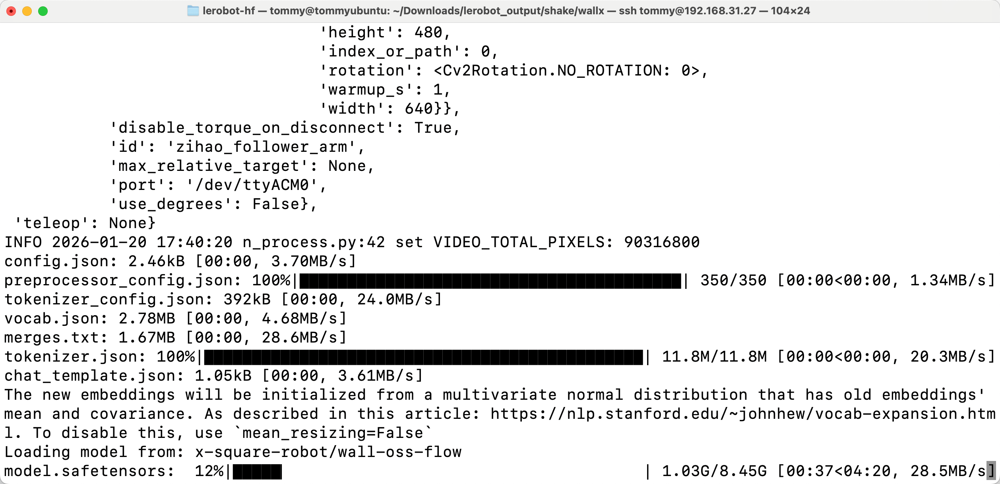

[English](../../en/09-inference/infer-wall-oss.md) | 简体中文 | [繁體中文](../../zh-hant/09-inference/infer-wall-oss.md) | [Deutsch](../../de/09-inference/infer-wall-oss.md) | [Español](../../es/09-inference/infer-wall-oss.md) | [Français](../../fr/09-inference/infer-wall-oss.md) | [Italiano](../../it/09-inference/infer-wall-oss.md) | [日本語](../../ja/09-inference/infer-wall-oss.md) | [한국어](../../ko/09-inference/infer-wall-oss.md) | [Português (BR)](../../pt-br/09-inference/infer-wall-oss.md) | [Português (PT)](../../pt-pt/09-inference/infer-wall-oss.md)

# 推理命令行-WALL-OSS

## Ubuntu

- 删除原有的eval开头的数据集（如有）

```Shell
sudo chmod 666 /dev/ttyACM*
sudo rm -rf /home/tommy/.cache/huggingface/lerobot/Tommymy/eval_lerobot_my_dataset_shake_hands
```

- 推理命令行

```Shell
lerobot-record  \
  --dataset.repo_id=Tommymy/eval_lerobot_my_dataset_shake_hands \
  --dataset.single_task="Shake Hands" \
  --policy.path=/home/tommy/Downloads/lerobot_output/shake/wallx/30K/pretrained_model \
  --dataset.push_to_hub=false \
  --robot.type=so101_follower \
  --robot.id=my_follower_arm \
  --robot.port=/dev/ttyACM0 \
  --robot.cameras="{front: {type: opencv, index_or_path: 0, width: 640, height: 480, fps: 60, fourcc: "MJPG"}}" \
  --display_data=false \
  --dataset.episode_time_s=1000
```



<figure view-type="Preview">[附件 / Attachment: c7b8a795e52ca10689d296d212dc8e53.mp4](../../en/images/c7b8a795e52ca10689d296d212dc8e53.mp4)</figure>


## 推理命令行-Mac

- 删除原有的eval开头的数据集（如有）

```Shell
sudo rm -rf /Users/tommy/.cache/huggingface/lerobot/Tommymy/eval_lerobot_my_dataset_shake_hands
```

- 推理命令行

```Shell
lerobot-record  \
  --dataset.repo_id=Tommymy/eval_lerobot_my_dataset_shake_hands \
  --dataset.single_task="Shake Hands" \
  --policy.path=/Users/tommy/Downloads/7-lerobot/shake/wallx/30K/pretrained_model \
  --dataset.push_to_hub=false \
  --robot.type=so101_follower \
  --robot.id=my_follower_arm \
  --robot.port=/dev/tty.usbmodem5AAF2193061 \
  --robot.cameras="{front: {type: opencv, index_or_path: 0, width: 1920, height: 1080, fps: 60, fourcc: "MJPG"}}" \
  --display_data=false \
  --dataset.episode_time_s=1000
```

<figure view-type="Preview">[附件 / Attachment: 9f4567abdcce7f983415aef8f42877d0.mp4](../../en/images/9f4567abdcce7f983415aef8f42877d0.mp4)</figure>