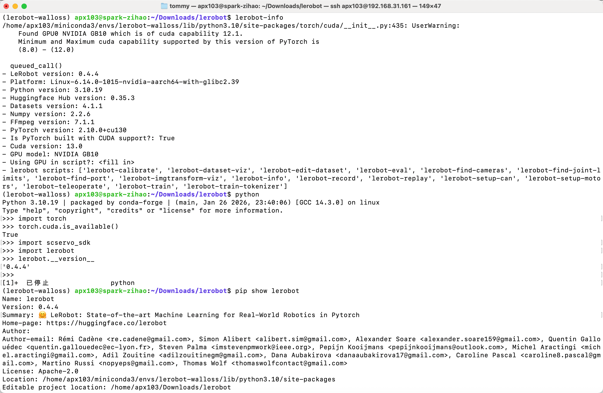
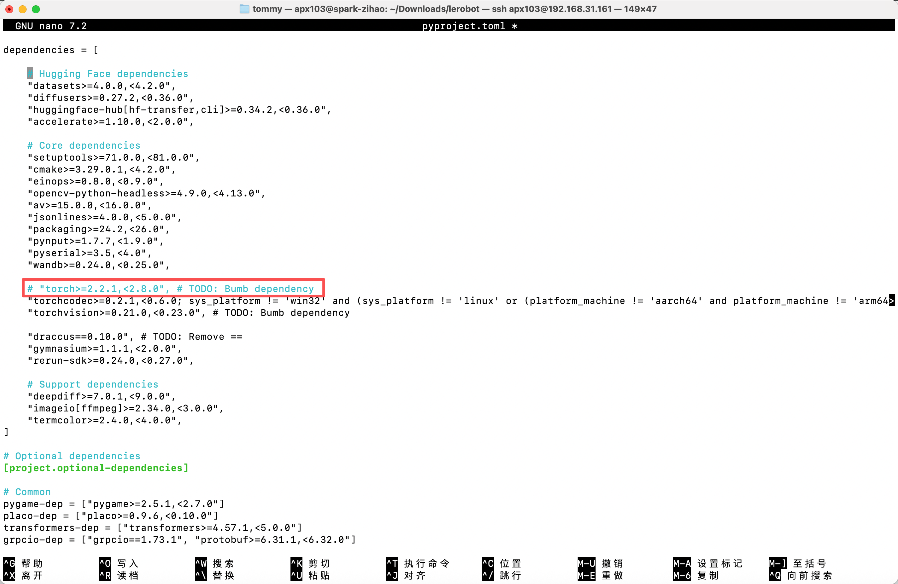
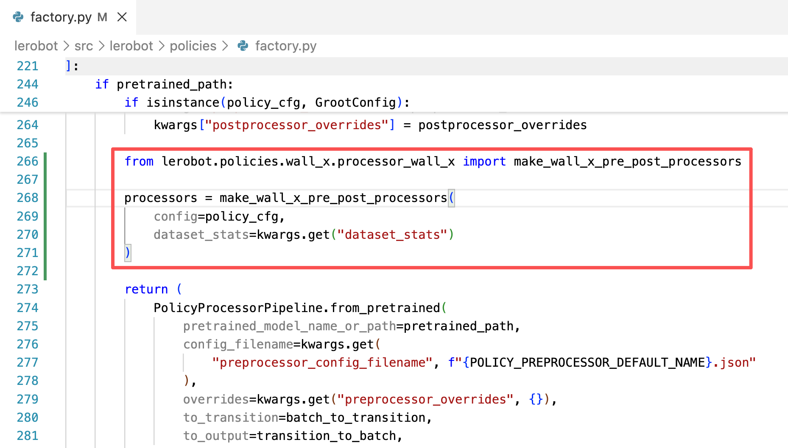

[English](../../en/09-inference/inference-dgx-spark.md) | 简体中文 | [繁體中文](../../zh-hant/09-inference/inference-dgx-spark.md) | [Deutsch](../../de/09-inference/inference-dgx-spark.md) | [Español](../../es/09-inference/inference-dgx-spark.md) | [Français](../../fr/09-inference/inference-dgx-spark.md) | [Italiano](../../it/09-inference/inference-dgx-spark.md) | [日本語](../../ja/09-inference/inference-dgx-spark.md) | [한국어](../../ko/09-inference/inference-dgx-spark.md) | [Português (BR)](../../pt-br/09-inference/inference-dgx-spark.md) | [Português (PT)](../../pt-pt/09-inference/inference-dgx-spark.md)

# 英伟达DGX Spark推理

## 安装环境

- Pytorch

pytorch单独从官网安装cuda13.0版本的

```Shell
pip3 install torch torchvision --index-url https://download.pytorch.org/whl/cu130
```



- 然后在pyproject.toml文件里把torch单独注释掉



再pip install -e .

- 注意推理命令行里的policy.path的路径，换成spark里面实际的模型路径

## 删除原有的eval开头的数据集（如有）

```Shell
sudo chmod 666 /dev/ttyACM*
```


```Shell
sudo rm -rf /home/apx103/.cache/huggingface/lerobot/Tommymy/eval_lerobot_my_dataset_shake_hands
```

## ACT

```Shell
lerobot-record  \
  --robot.type=so101_follower \
  --robot.port=/dev/ttyACM0 \
  --robot.cameras="{ front: {type: opencv, index_or_path: 0, width: 640, height: 480, fps: 60, fourcc: "MJPG"}}" \
  --robot.id=my_follower_arm \
  --display_data=false \
  --dataset.repo_id=Tommymy/eval_lerobot_my_dataset_shake_hands \
  --dataset.single_task="Shake Hands" \
  --dataset.episode_time_s=1000 \
  --policy.path=/home/apx103/Downloads/lerobot_output/shake/ACT/5K/pretrained_model
```

## SmolVLA

- 安装环境

```Shell
conda activate base
conda create -y -n lerobot-smolvla python=3.10 -y
conda activate lerobot-smolvla
conda install ffmpeg=7.1.1 -c conda-forge -y

pip3 install torch torchvision --index-url https://download.pytorch.org/whl/cu130

cd lerobot
pip install -e ".[feetech,smolvla]"
```

- 推理

```Shell
lerobot-record  \
  --robot.type=so101_follower \
  --robot.port=/dev/ttyACM0 \
  --robot.cameras="{ front: {type: opencv, index_or_path: 0, width: 640, height: 480, fps: 60, fourcc: "MJPG"}}" \
  --robot.id=my_follower_arm \
  --display_data=false \
  --dataset.repo_id=Tommymy/eval_lerobot_my_dataset_shake_hands \
  --dataset.single_task="Shake Hands" \
  --dataset.episode_time_s=1000 \
  --policy.path=/home/apx103/Downloads/lerobot_output/shake/smolvla/40K/pretrained_model
```

## WALL-OSS

- 安装环境

```Shell
cd lerobot
pip install -e ".[feetech,wallx]"
```

- 添加代码



```Shell
lerobot-record  \
  --dataset.repo_id=Tommymy/eval_lerobot_my_dataset_shake_hands \
  --dataset.single_task="Shake Hands" \
  --policy.path=/home/apx103/Downloads/lerobot_output/shake/wallx/30K/pretrained_model \
  --dataset.push_to_hub=false \
  --robot.type=so101_follower \
  --robot.id=my_follower_arm \
  --robot.port=/dev/ttyACM0 \
  --robot.cameras="{front: {type: opencv, index_or_path: 0, width: 640, height: 480, fps: 60, fourcc: "MJPG"}}" \
  --display_data=false \
  --dataset.episode_time_s=1000
```

## pi0

- 安装环境

```Shell
conda create -y -n lerobot-pi python=3.10 -y
conda activate lerobot-pi
conda install ffmpeg=7.1.1 -c conda-forge -y

cd lerobot
pip3 install torch torchvision --index-url https://download.pytorch.org/whl/cu130
pip install -e ".[feetech,pi]"
```

- 推理

```Shell
lerobot-record  \
  --robot.type=so101_follower \
  --robot.port=/dev/ttyACM0 \
  --robot.cameras="{ front: {type: opencv, index_or_path: 0, width: 640, height: 480, fps: 60, fourcc: "MJPG"}}" \
  --robot.id=my_follower_arm \
  --display_data=false \
  --dataset.repo_id=Tommymy/eval_lerobot_my_dataset_shake_hands \
  --dataset.single_task="Shake Hands" \
  --dataset.episode_time_s=1000 \
  --dataset.push_to_hub=false \
  --policy.path=/home/apx103/Downloads/lerobot_output/shake/pi0/50K/pretrained_model
```