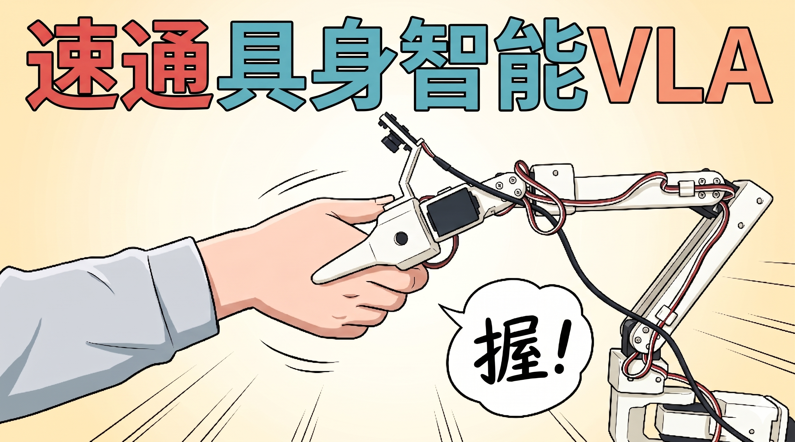

[English](../en/index.md) | 简体中文 | [繁體中文](../zh-hant/index.md) | [Deutsch](../de/index.md) | [Español](../es/index.md) | [Français](../fr/index.md) | [Italiano](../it/index.md) | [日本語](../ja/index.md) | [한국어](../ko/index.md) | [Português (BR)](../pt-br/index.md) | [Português (PT)](../pt-pt/index.md)

# 目录

## **点左上角这两个图标，展开所有章节目录**

## 什么是具身智能？

具备身体的智能。把AI接入各种硬件实体，比如：

四足机器狗、双足人形机器人、轮足机器人、无人机、自动驾驶车

## LeRobot是什么？

LeRobot是HuggingFace开源的`具身智能机器人软件框架`

Github地址：https://github.com/huggingface/lerobot

低门槛实现：强化学习和**模仿学习（VLA）**的**数据采集、算法训练、推理部署**，其中最主要是**模仿学习（VLA）**

- 哪些机器人可以用LeRobot开发？

从千元级别的SO-ARM 101机械臂、LeKiwi小车、到几万的松灵piper机械臂、华馨京StarAI机械臂、Hope-JR灵巧手，到十几万的宇树G1人形机器人。LeRobot已经成为具身智能行业，数据采集和算法训练的规范。

你也可以让你自己的机器人适配LeRobot框架。

- LeRobot数据集和模型

LeRobot定义了自己的模仿学习数据集格式，你可以查看、使用、下载、训练所有HuggingFace上的公开数据集和模型，也可以上传自己的数据集到HuggingFace上

## SO-ARM 101机械臂是什么？

本教程以SO-ARM 101机械臂为例，采用3D打印结构件和飞特舵机，成本非常低。

这是穷学生也能买得起的具身智能本体，也是LeRobot官方推荐的本体之一。

机械臂包含主动臂（Leader）和从动臂（Follower）两个机械臂。每个机械臂都包含5个自由度+1个夹爪自由度。

## 我需要什么电脑配置

一台普通Windows笔记本电脑可以完成训练之前的所有操作

一台普通的Mac电脑，可以完成所有操作

一台带英伟达显卡的Ubuntu电脑，可以完成所有操作

本教程中，使用[云GPU平台](https://featurize.cn?s=d7ce99f842414bfcaea5662a97581bd1)训练模型，不需要自己电脑有很高的配置

## 什么是**模仿学习和VLA**？

人类拖拽机器人示教采集数据集，形成数据集。然后用这个数据集训练模仿学习算法，最终部署在机器人上，让机器人自主模仿人类动作，泛化到真实环境。无需遥操作和遥控。

比如上面的视频中，人类拖拽SO-ARM机械臂抓小龙虾、蘸调料、下油锅，最终让机械臂自主完成这一动作。就算来一只新的小龙虾也能随时反应并完成动作。

模仿学习也有一个前沿时髦的名字：VLA（视觉语言动作大模型）。这也是现在发展最迅速、投资最火爆、中美竞争最激烈、开源生态最繁荣、媒体高度关注、无数硕博争相进入的具身智能研究领域。

LeRobot最主要适配的算法就是模仿学习。比如ACT、Diffusion Policy、SmolVLA、Pi0、Pi0.5、Wall-OSS等。

教程中的模仿学习只有VLA。