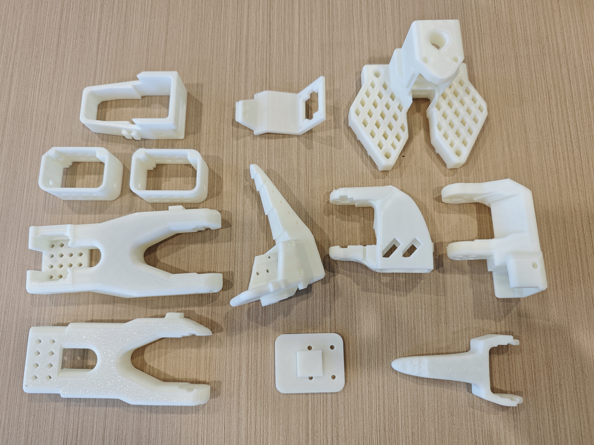
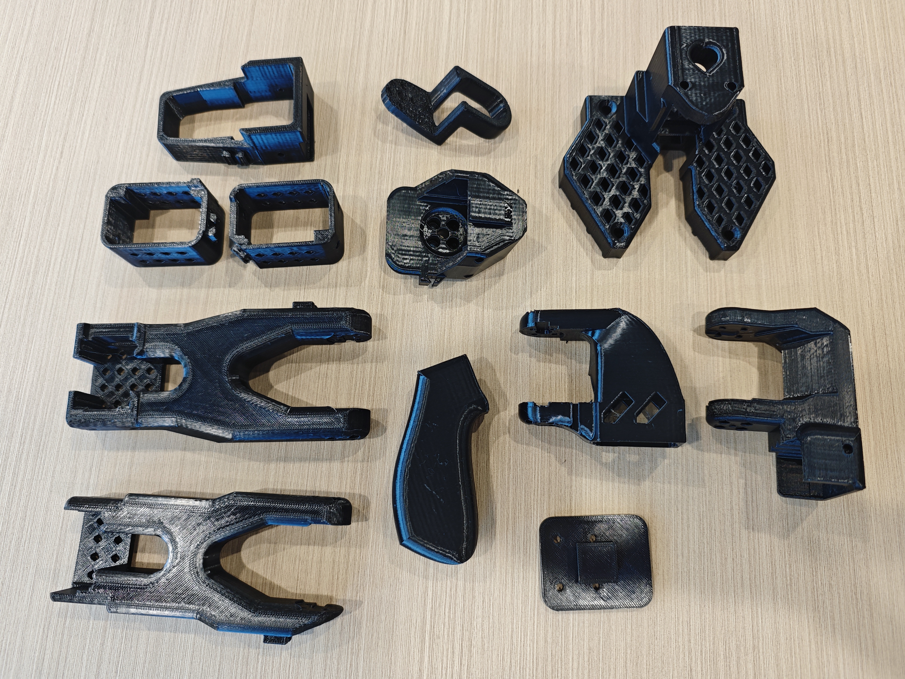
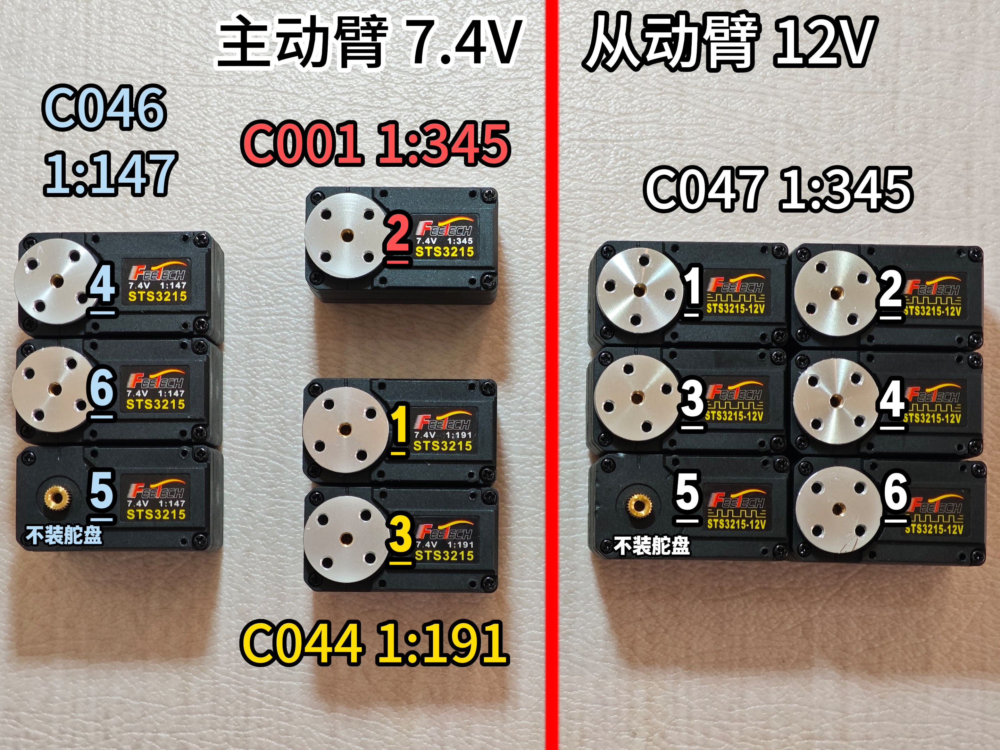
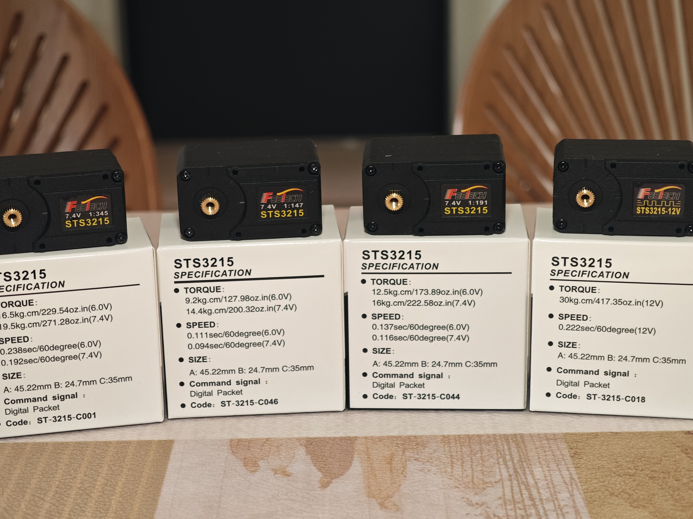
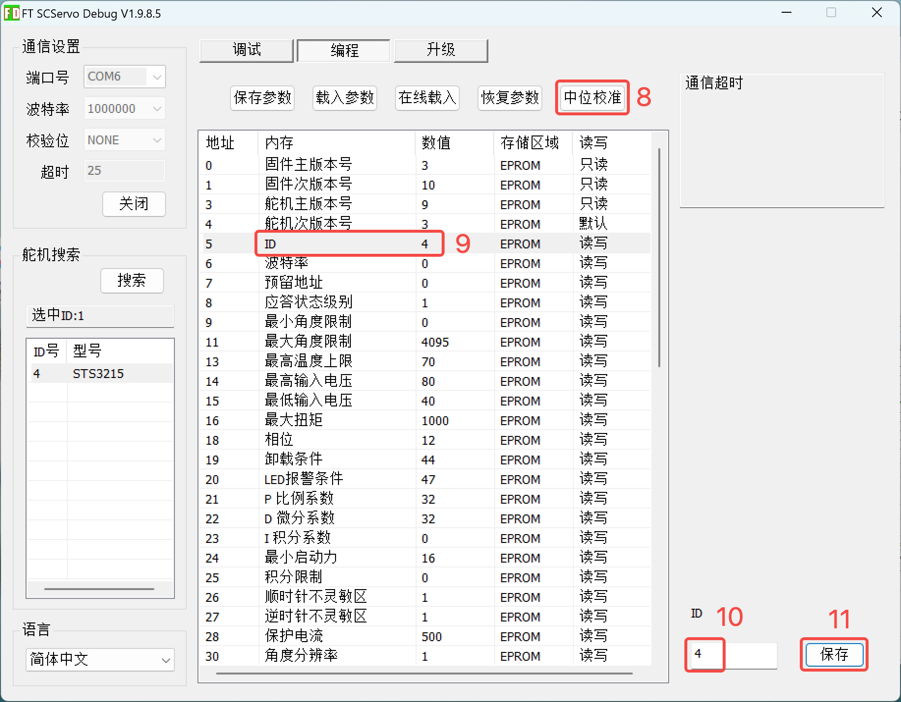
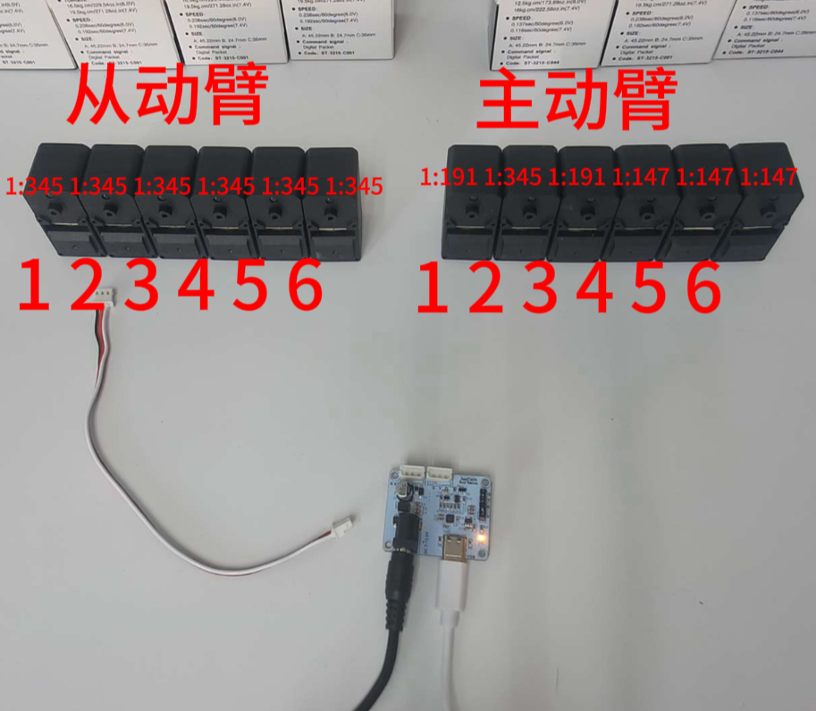
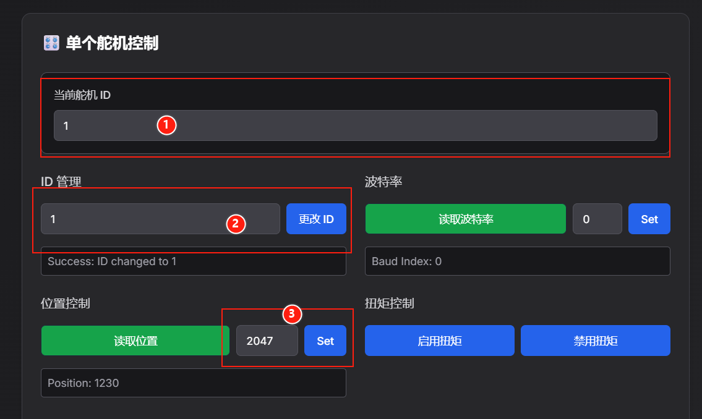

[English](../en/so-arm101-assembly.md) | 简体中文 | [繁體中文](../zh-hant/so-arm101-assembly.md) | [Deutsch](../de/so-arm101-assembly.md) | [Español](../es/so-arm101-assembly.md) | [Français](../fr/so-arm101-assembly.md) | [Italiano](../it/so-arm101-assembly.md) | [日本語](../ja/so-arm101-assembly.md) | [한국어](../ko/so-arm101-assembly.md) | [Português (BR)](../pt-br/so-arm101-assembly.md) | [Português (PT)](../pt-pt/so-arm101-assembly.md)

<title>SO-ARM101机械臂散件组装教程</title>

<callout emoji="💡">
注意：成品机械臂请跳过本教程
</callout>

## 从动臂的3D打印件



## 主动臂的3D打印件



主动臂和从动臂非常类似，只有末端不一样

主动臂是把手和扳机，从动臂是夹爪

## 拆除3D打印件上残留的支撑

检查每一个孔、洞、槽、网格，特别是类似麻将“五筒”的五个孔

这一步非常重要，不然后面拧螺丝拧不进去

## 四种舵机区分

<table><colgroup><col/><col/><col/><col/><col/><col/></colgroup><tbody><tr><td vertical-align="middle">大型号</td><td vertical-align="middle">小型号</td><td vertical-align="middle">电压（V）</td><td vertical-align="middle">减速比</td><td vertical-align="middle">机械臂关节</td><td vertical-align="middle">数量</td></tr><tr><td rowspan="4" vertical-align="middle">STS-3215</td><td vertical-align="middle">C001</td><td vertical-align="middle">7.4</td><td vertical-align="middle">1:345</td><td vertical-align="middle">主动臂2</td><td vertical-align="middle">1</td></tr><tr><td vertical-align="middle">C044</td><td vertical-align="middle">7.4</td><td vertical-align="middle">1:191</td><td vertical-align="middle">主动臂1、3</td><td vertical-align="middle">2</td></tr><tr><td vertical-align="middle">C046</td><td vertical-align="middle">7.4</td><td vertical-align="middle">1:147</td><td vertical-align="middle">主动臂4、5、6</td><td vertical-align="middle">3</td></tr><tr><td vertical-align="middle">C047</td><td vertical-align="middle">12</td><td vertical-align="middle">1:345</td><td vertical-align="middle">从动臂所有关节</td><td vertical-align="middle">6</td></tr></tbody></table>

> 减速比是 “电机转速：舵机输出轴转速” 的比值，比如 1:345 代表电机转 345 圈，舵机输出轴才转 1 圈。
> 
> 大减速比会通过齿轮组放大扭矩，所以能带动更重的负载（比如从动臂）
> 
> 但同时，输出轴的转动速度会更慢（因为被“减速”了）
> 
> 如果拖拽关节，会更费力

下面是本项目所有舵机的型号、减速比，下划线是它们的编号





## 区分两种电压的电源适配器

5V 6A 30W的电源适配器：给7.4V舵机供电（主动臂）黑色

12V 5A 60W的电源适配器，给12V舵机供电（从动臂）白色

## 下载飞特舵机调试工具

### Windows电脑

https://gitee.com/ftservo/fddebug

下载[`FD1.9.8.5(250729).7z`](https://gitee.com/ftservo/fddebug/blob/master/FD1.9.8.5(250729).7z)，解压，运行里面的exe程序

### Ubuntu电脑和Mac电脑（压缩包含教程）

<figure view-type="Card">[附件 / Attachment: Juxi_ServoController.zip](../en/images/Juxi_ServoController.zip)</figure>


**Pro版 主动臂使用5V6A电源适配器，从动臂使用12V5A电源适配器**

舵机ID设置和舵机角度校准及组装要提前做好，可参考[官方组装教程](https://huggingface.co/docs/lerobot/so101)

<sheet sheet-id="kN3ZzK" token="DDCXsU4TCh4wpytxOAkcO9u8nsc"></sheet>

# 第一步：设置舵机ID，安装舵盘（除5号舵机）

<grid>
<column width-ratio="0.500000">

</column>
<column width-ratio="0.500000">

</column>
</grid>

1. 打开飞特上位机调试工具，选择COM端口号，波特率为一百万，点“打开”
2. 点“搜索”，出现“STS3215”后，点“停止”，点“STS3215”
3. 选择上方“调试”，可以拖拽滑条让舵机旋转，也可以点“扫描”让舵机往复运动。确认舵机运行正常
4. 选择上方“编程”
5. 点“中位校准”，设置此时舵机旋转轴位置为中位（0-4095）
6. 点“ID”，在右下角设置对应舵机的ID编号，点“保存”。注意编号是纯阿拉伯数字，不加字母。
7. 拔掉舵机连接控制板的线
8. 在舵机上插上舵机线

1号舵机插两根线，其它舵机先只插一根线



<callout emoji="💡">
再次提醒，请确保舵机关节 ID 和齿轮比与 **SO-ARM101** 的严格对应。
</callout>

总线上每个电机都有一个唯一的ID。新电机通常带有一个默认ID `1`。为了确保电机和控制器之间的通信正常，我们首先需要为每个电机设置一个唯一的ID。此外，总线上的数据传输速度由波特率决定。为了能够相互通信，控制器和所有电机都需要配置相同的波特率，本机械臂舵机的波特率为100000。

为此，我们首先需要将控制器分别连接到每个电机，以便进行设置。由于我们会将这些参数写入电机内部存储器（EEPROM）的非易失性区域，因此只需操作一次即可。

如果您要重新利用其他机器人的电机，您可能还需要执行此步骤，因为 ID 和波特率可能不匹配。

下面的视频展示了设置电机 ID 的步骤顺序。

## Windows系统

<figure view-type="Card">[附件 / Attachment: 飞特舵机上位机.zip](../en/images/飞特舵机上位机.zip)</figure>

使用飞特舵机上位机设置舵机ID并校准中位，ID设置是从1到6的！

<figure view-type="Preview">[附件 / Attachment: 机械臂舵机设置ID-Windows系统.mp4](../en/images/机械臂舵机设置ID-Windows系统.mp4)</figure>

## Linux/ubuntu系统和Mac电脑

<callout emoji="💡">
如需飞特舵机上位机可参考上面的 [飞特舵机调试工具](https://juxitech.feishu.cn/wiki/HllBwhjJ1iayMdkUTGgcyKbgn8g#share-Jvk1dRRl8oY0Skxrt2VczA9jnNb)
</callout>

请先按照 [官方Lerobot环境安装](https://huggingface.co/docs/lerobot/installation) 这一页完成环境部署

<callout emoji="💡">
注意激活虚拟环境并进入到对应的src/lerobot目录下
conda activate lerobot
cd lerobot/src/lerobot
</callout>

1、查找机械臂对应的 USB 端口 为了找到每个机械臂正确的端口，请运行实用脚本两次：：

```Plain Text
lerobot-find-port
```

识别Leader机械臂端口时的示例输出（例如，Mac 上为 `/dev/tty.usbmodem575E0031751`，或 Linux 上可能为 `/dev/ttyACM0`）：

```PowerShell
Finding all available ports for the MotorBus.
['/dev/ttyACM0', '/dev/ttyACM1']
Remove the usb cable from your MotorsBus and press Enter when done.

[...Disconnect corresponding leader or follower arm and press Enter...]

The port of this MotorsBus is /dev/ttyACM1
Reconnect the USB cable.
```

识别Follower机械臂端口时的示例输出（例如，`/dev/tty.usbmodem575E0032081`，或在 Linux 上可能为 `/dev/ttyACM1`）：

```PowerShell
Finding all available ports for the MotorBus.
['/dev/ttyACM0', '/dev/ttyACM1']
Remove the usb cable from your MotorsBus and press Enter when done.

[...Disconnect corresponding leader or follower arm and press Enter...]

The port of this MotorsBus is /dev/ttyACM0
Reconnect the USB cable.
```

<callout emoji="💡">
请记住要拔出 USB 接头，否则将无法检测到接口。
</callout>

2、使用 USB 数据线从电脑连接到从动臂的舵机驱动板，并接通电源。然后，运行以下命令。请将命令中的--robot.port=/dev/ttyACM0 修改为找到的端口号。如查找的端口为/dev/ttyACM1，则修改为--robot.port=/dev/ttyACM1

```Python
lerobot-setup-motors \
    --robot.type=so101_follower \
    --robot.port=/dev/ttyACM0
```

您会看到以下输出。

```Python
Connect the controller board to the 'gripper' motor only and press enter.
```

依照指示，连接夹爪的舵机。请确保它是唯一连接到舵机驱动板的舵机，并且该舵机尚未与其他任何舵机进行连接。当您按下 **[Enter]** 键后，脚本将自动设置该舵机的 ID 和波特率，ID设置是从6到1的！

之后，您应该会看到以下信息：

```Python
'gripper' motor id set to 6
```

接着是下一条输出是:

```Python
Connect the controller board to the 'wrist_roll' motor only and press enter.
```

<callout emoji="❗">
**注意** 根据指示，对每个舵机重复上述操作。
与之前的舵机一样，请确保它是唯一连接到驱动板的舵机，并且舵机本身没有连接到任何其他舵机。
</callout>

在每次按 **Enter** 键之前，请务必检查您的线缆连接。例如，在操作电路板时，电源线可能会断开。

当您完成所有步骤后，脚本将自动结束，此时舵机即可投入使用。现在，您可以将每根舵机的 3 针接口依次连接，并将第一个舵机（ID 为 1 的“shoulder pan”舵机）的线缆连接到驱动板。现在可以将驱动板安装到机械臂的底座上。

对主动臂重复相同的步骤。

```Python
lerobot-setup-motors \
    --teleop.type=so101_leader \
    --teleop.port=/dev/ttyACM0
```

<figure view-type="Preview">[附件 / Attachment: 机械臂舵机设置ID-Linux系统.mp4](../en/images/机械臂舵机设置ID-Linux系统.mp4)</figure>

# 第二步：组装

<callout emoji="💡">
- 从动臂的组装步骤与主动臂基本相同。唯一的区别在于第12步之后，末端执行器（夹爪和手柄）的安装方式有所不同。
</callout>

<figure view-type="Preview">[附件 / Attachment: SO-ARM101机械臂组装教程.mp4](../en/images/SO-ARM101机械臂组装教程.mp4)</figure>

<callout emoji="💡">
舵机驱动板的安装：先安装4个铜柱，然后用四个M2.5\*8的螺丝固定驱动板
</callout>

<grid>
<column width-ratio="0.525947">

</column>
<column width-ratio="0.474053">

</column>
</grid>


**Pro版 黑色主动臂使用5V6A电源适配器，白色从动臂使用12V5A电源适配器**


# 网页端设置舵机ID和中位校准

https://bambot.org/feetech.js?lang=zh

1、根据舵机型号输入0或1，点击“连接”


2、扫描ID 1\~6 的舵机，可以根据扫描结果里的FOUND确认对应ID舵机。例如图片里舵机 ID 1 被扫描到了


3、ID设置和中位校准

①当前舵机ID输入为被扫描到的舵机ID

②在“ID管理”中输入数字，点击“更改ID”即可设置ID

③中位校准（STS3215舵机中位是2047，SCS0009舵机中位是511）

STS舵机：在“位置控制”输入2047，并点击“Set”

SCS舵机：在“位置控制”输入511，并点击“Set”

