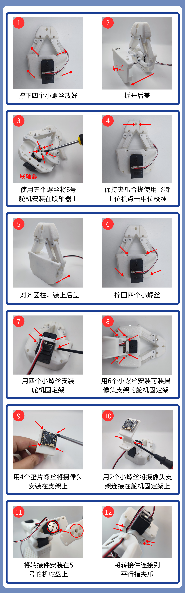

[English](../../en/so-arm101-assembly/parallel-jaw-gripper.md) | 简体中文 | [繁體中文](../../zh-hant/so-arm101-assembly/parallel-jaw-gripper.md) | [Deutsch](../../de/so-arm101-assembly/parallel-jaw-gripper.md) | [Español](../../es/so-arm101-assembly/parallel-jaw-gripper.md) | [Français](../../fr/so-arm101-assembly/parallel-jaw-gripper.md) | [Italiano](../../it/so-arm101-assembly/parallel-jaw-gripper.md) | [日本語](../../ja/so-arm101-assembly/parallel-jaw-gripper.md) | [한국어](../../ko/so-arm101-assembly/parallel-jaw-gripper.md) | [Português (BR)](../../pt-br/so-arm101-assembly/parallel-jaw-gripper.md) | [Português (PT)](../../pt-pt/so-arm101-assembly/parallel-jaw-gripper.md)

# 平行指夹爪安装教程

[Onshape](https://cad.onshape.com/documents/96518c699fd03eea508b06d3/w/d5f95a6266b027d84ae48634/e/317bed52afdde5ea3dcfc236)查看模型文件

<figure view-type="Card">[附件 / Attachment: PincOpen装配体.step](../../en/images/PincOpen装配体.step)</figure>

<figure view-type="Card">[附件 / Attachment: 平行指夹爪安装步骤.mp4](../../en/images/平行指夹爪安装步骤.mp4)</figure>

## 1、拧开四个小螺丝，拆下后盖

## 2、使用五个螺丝将6号舵机安装在联轴器上

## 3、使用飞特上位机点击中位校准（保持 夹爪合拢！）

**下载飞特舵机调试工具**

- Windows电脑

https://gitee.com/ftservo/fddebug

下载[`FD1.9.8.5(250729).7z`](https://gitee.com/ftservo/fddebug/blob/master/FD1.9.8.5(250729).7z)，解压，运行里面的exe程序

- Ubuntu电脑

https://github.com/Kotakku/FT_SCServo_Debug_Qt

1. 打开飞特上位机调试工具，选择COM端口号，波特率为一百万，点“打开”
2. 点“搜索”，出现“STS3215”后，点“停止”，点“STS3215”
3. 选择上方“编程”
4. 点“中位校准”

## 4、对齐圆柱，装上后盖

## 5、拧回四个小螺丝

## 6、用四个小螺丝安装舵机固定架

## 7、用6个小螺丝安装可装摄像头支架的舵机固定架

## 8、用4个垫片螺丝将摄像头安装在支架上

## 9、用2个小螺丝将摄像头支架连接在舵机固定架上

## 10、将转接件安装在5号舵机舵盘上

## 11、将转接件连接到平行指夹爪