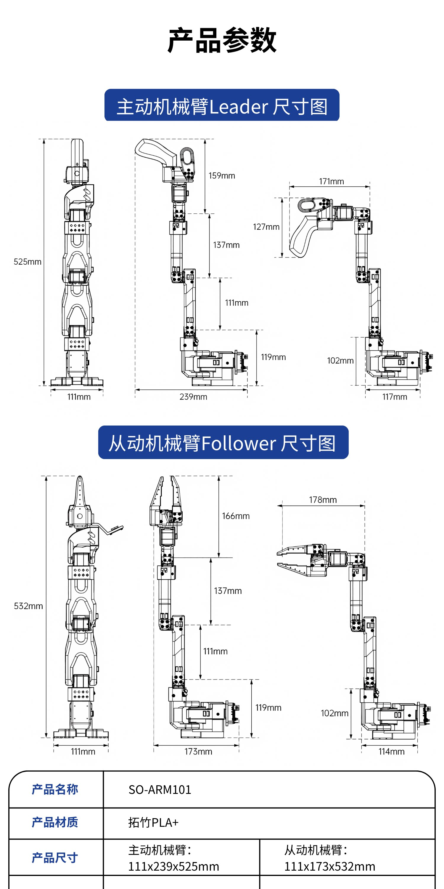

[English](../en/so-arm101-tutorial.md) | 简体中文 | [繁體中文](../zh-hant/so-arm101-tutorial.md) | [Deutsch](../de/so-arm101-tutorial.md) | [Español](../es/so-arm101-tutorial.md) | [Français](../fr/so-arm101-tutorial.md) | [Italiano](../it/so-arm101-tutorial.md) | [日本語](../ja/so-arm101-tutorial.md) | [한국어](../ko/so-arm101-tutorial.md) | [Português (BR)](../pt-br/so-arm101-tutorial.md) | [Português (PT)](../pt-pt/so-arm101-tutorial.md)

<title>SO-ARM101机械臂教程</title>

# 产品简介

SO-ARM101 是由 Hugging Face 旗下 LeRobot 团队打造的**低成本、全开源 6 自由度机械臂**，专为教育入门、科研验证与轻量工业原型开发设计，以高灵活性与完整开源生态，降低具身智能与机器人技术的应用门槛。

### 一、硬件设计：高性能模块化，易组装可定制

- **结构材质**：核心结构采用 3D 打印件与加固承重部件结合，优化走线与关节设计，避免运动干涉，兼顾轻量化与耐用性，用户可自行打印替换或扩展结构件。
- **驱动配置**：从动臂 搭载**6 个 12V 30KG 大扭矩磁编码舵机**，配合 360° 磁编码反馈与 PID 控制算法，运动丝滑无抖动，重复定位精度高，动力强劲且动作精准。
- **视觉系统**：标配**双摄智能视觉系统**，末端摄像头捕捉近距离抓取细节，全局摄像头覆盖作业环境，双摄数据融合构建立体模型，为模仿学习提供丰富数据支撑。
- **控制连接**：配备舵机驱动板，通过 USB-C 接口直连电脑或树莓派，即插即用，简化硬件连接流程，快速搭建控制环境。

### 二、软件生态：深度集成 LeRobot，AI 开发零门槛

- **核心框架兼容**：深度适配 Hugging Face **LeRobot 开源机器人 ML 框架**，基于 PyTorch 构建，内置预训练模型、多场景数据集及仿真环境，兼容 Stanford ALOHA 等知名开源数据集。
- **低延迟通信**：采用**DORA 分布式数据流引擎**，实现硬件与算法的低延迟交互，Python 运行性能较 ROS2 快 17 倍，支持代码热重载，无需重启即可实时调整策略。
- **全栈开源**：硬件 3D 打印文件、软件控制代码、AI 训练脚本及全套教程**完全开源**，用户可自由修改、二次开发，快速实现个性化功能扩展。

### 三、核心应用场景：从入门到落地，全场景适配

1. **机器人教育入门**：提供从机械臂组装、基础编程到 AI 策略部署的全流程教程，配套可视化操作界面与案例代码，零基础用户可快速掌握机器人控制与 AI 应用技能。
2. **科研算法验证**：专注**模仿学习、强化学习**研究，支持通过 VR 录制人类操作数据训练机器人；典型案例：基于 50 段 15 秒操作视频，2 小时训练即可掌握叠衣、插钥匙、物料分拣等任务。
3. **轻量工业原型**：低成本验证自动化方案，适配**物料搬运、精密装配、零件分拣**等场景，以千元级成本实现工业级机械臂的核心功能，快速落地原型验证。

### 四、产品优势

- **极致性价比**：基础版起售价约 100 美元，开源设计降低采购与二次开发成本，适合个人、实验室及中小企业批量部署。
- **全链路开源**：硬件、软件、教程全面开放，无技术壁垒，支持用户自由定制与功能扩展，快速适配多场景需求。
- **AI 开发友好**：依托 LeRobot 生态，一键调用预训练模型与数据集，简化数据采集、策略训练到部署的全流程，加速具身智能算法落地。

### 五、产品参数

| **规格项** | **参数详情** |
|-|-|
| 自由度 | 6 轴（肩部平移 / 俯仰、肘部屈曲、腕部屈曲 / 旋转、夹爪开合） |
| 结构材料 | 3D 打印件（PLA+） |
| 驱动电机 | 12 \* 飞特 STS3215 伺服电机（12V 供电）   从动臂 STS3215-C018 齿轮比：1/345   主动臂 STS3215-C001 齿轮比：1/345（肩部）、STS3215-C044 1/191（肘部）、STS3215-C046 1/147（腕部） |
| 负载能力 | 末端最大负载 200g（夹爪闭合状态） |
| 重复定位精度 | ±1.5mm（受校准与电机回差影响） |
| 工作半径 | 末端最大伸展距离 350mm |
| 电源需求 | 主动臂（Leader）：5V 6A 适配器；从动臂（Follower）：12V 5A 适配器（高扭矩需求） |
| 通信接口 | USB-C 直连电脑（控制指令传输） |
| 视觉系统 | 摄像头（1080P@30FPS，FOV86°无畸变 或 定焦1080P@60FPS FOV100°） |
| 夹爪类型 | PLA+夹爪、TPU夹爪，支持二指平行夹爪，开合范围 0-50mm，最大夹持力 5N |
| 控制框架 | 基于 Python 的 LeRobot 库，提供电机控制 API（lerobot.control） |
| 预训练模型 | 支持 ACT（Action Chunking Transformer）、Diffusion Policy 等模仿学习算法 |
| 轻量模型 | SmolVLA 视觉 - 语言 - 动作模型（450M 参数）：・CPU 实时推理（MacBook 可运行）・异步响应提速 30%・每帧仅需 64 个视觉标记・状态可视化：rerun 库实时监控 |
| 整机重量 | ≈1.2kg（含电机及线缆） |
| 装配尺寸 | 底座直径 120mm，高度（完全伸展）650mm |
| 工作温度 | 0℃–40℃（伺服电机限值） |
| 噪音水平 | <45dB（空载运行） |
| 入门教程 | 有 |
| 官方 GITHUB | 有 |

| **条目 / 包名** | **功能 / 描述** |
|-|-|
| LeRobot 库 | 版本：≥0.1.0核心控制框架：• Python API（lerobot.control）・实时运动规划・传感器数据流处理 |
| PyTorch | 版本：≥2.0深度学习推理引擎（支持 SmolVLA 等模型） |
| Transformers | 版本：≥4.40.0Hugging Face 模型库（加载预训练 ACT/Diffusion Policy） |
| rerun | 版本：≥0.16.0实时机器人状态可视化工具（3D 关节角度 / 轨迹渲染） |
| ROS 2 | 版本：Humble/Foxy可选：ROS2 驱动接口（soarm100_ros 包） |
| ACT | 动作分块 Transformer，长序列动作预测（如连续抓取任务） |
| Diffusion Policy | 扩散策略，高维动作空间下的鲁棒控制（抗干扰操作） |
| SmolVLA | 视觉 - 语言 - 动作模型，多模态指令执行（如 “抓取红色方块”）・450M 参数，CPU/GPU 通用 |

| **功能分类** | **功能描述** |
|-|-|
| 关节级控制 | ・6 轴独立角度 / 速度控制（±180° 范围）・关节软限位保护・实时反馈电机温度 / 电压 |
| 笛卡尔空间控制 | ・末端 XYZ 坐标定位（精度 ±1.5mm）・欧拉角姿态调整（Roll/Pitch/Yaw） |
| 夹爪操作 | ・开合度 0-50mm 无极调节・握力动态调整（0.1-5N）・物体厚度自适应夹持 |
| 主从模式 | ・主动臂（Leader）手动示教 → 从动臂（Follower）实时模仿・动作数据录制 / 回放 |

| **功能分类** | **功能描述** |
|-|-|
| 模仿学习 | ・人类演示数据录制 → 训练 ACT/Diffusion Policy 模型・支持多任务策略迁移（如积木堆叠→物品分类） |
| 多模态交互 | ・SmolVLA 模型解析自然语言指令（例：“抓取蓝色方块”）・视觉 - 动作端到端执行 |
| 强化学习接口 | ・Gymnasium 兼容环境・奖励函数自定义（如任务完成时间 / 能耗优化） |
| 校准系统 | ・主从臂零点校准・摄像头 - 机械臂手眼标定・关节扭矩自动补偿 |
| 数据流管理 | ・录制 / 回放 .h5 格式数据集・Hugging Face Hub 云端同步・传感器数据时间戳对齐 |
| 实时监控 | ・rerun 可视化关节角度 / 末端轨迹・电机异常报警（过热 / 堵转）・通信延迟诊断 |
| ROS 2 集成 | ・发布关节状态（/joint_states）・订阅控制指令（/arm_controller）・点云流传输（/depth_points） |
| 跨平台部署 | • Linux/Windows/macOS（Python API）・Docker 容器化封装・Web 远程控制（FastAPI 接口） |