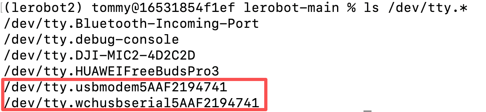

[English](../../en/02-find-serial-port/mac.md) | [简体中文](../../zh-hans/02-find-serial-port/mac.md) | 繁體中文 | [Deutsch](../../de/02-find-serial-port/mac.md) | [Español](../../es/02-find-serial-port/mac.md) | [Français](../../fr/02-find-serial-port/mac.md) | [Italiano](../../it/02-find-serial-port/mac.md) | [日本語](../../ja/02-find-serial-port/mac.md) | [한국어](../../ko/02-find-serial-port/mac.md) | [Português (BR)](../../pt-br/02-find-serial-port/mac.md) | [Português (PT)](../../pt-pt/02-find-serial-port/mac.md)

# MAC電腦

## 檢視埠

```Shell
ls /dev/tty.*
```

效果類似下圖，用兩個連接埠中的任意一個都可



## 為連接埠賦予權限

讓所有使用者都有權限讀寫這些序列埠裝置

```Shell
chmod 666 /dev/tty.*
```

## 記錄我的連接埠

從動臂：

/dev/tty.usbmodem5AAF2193061

/dev/tty.wchusbserial5AAF2193061

主動臂：

/dev/tty.usbmodem5AAF2194741

/dev/tty.wchusbserial5AAF2194741

## 為什麼Mac中會有兩個連接埠？

我們用的伺服馬達控制板，在Mac系統中會被**同時識別為兩種不同類型的序列埠驅動程式**，所以會顯示兩個連接埠：

- 一個是系統預設的通用序列埠驅動程式（`/dev/tty.usbmodemxxxx`）
- 另一個是晶片廠商（例如這裡的 「wch」 對應南京沁恆的 CH340/CH341 晶片）提供的專用序列埠驅動程式（`/dev/tty.wchusbserialxxxx`）

這屬於正常現象，**兩個連接埠其實對應同一個硬體裝置**，選擇其中任意一個都可以連接通訊（例如在控制機械手臂的軟體中選擇其中一個連接埠即可）。

如果後續操作某一個連接埠報錯，可以換成另一個連接埠試試。
