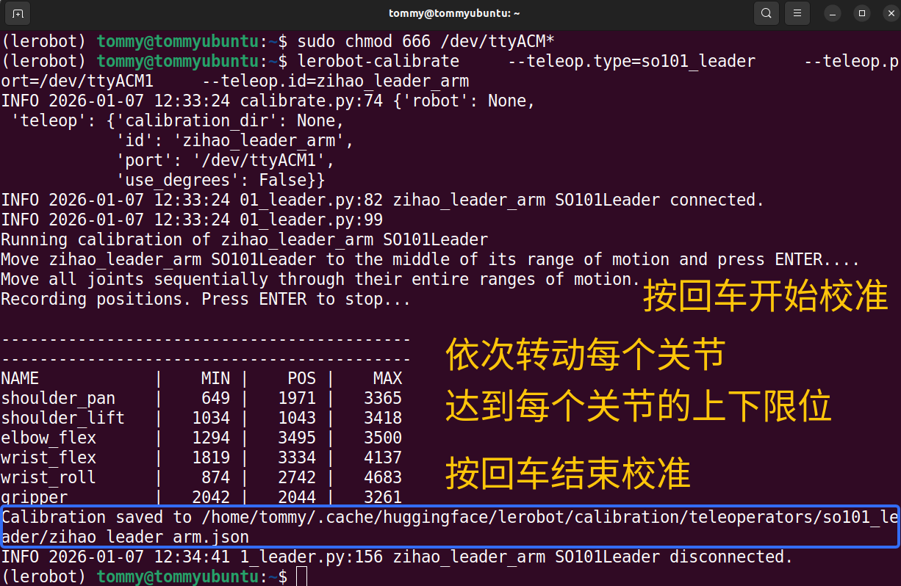
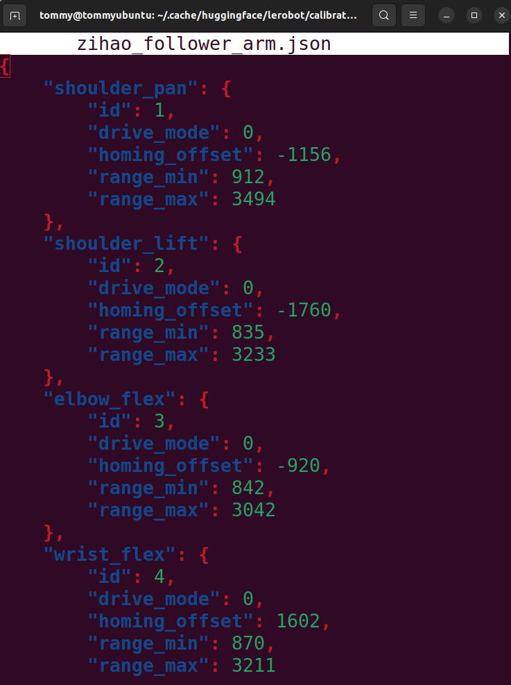

[English](../../en/03-calibrate-arm/ubuntu.md) | [简体中文](../../zh-hans/03-calibrate-arm/ubuntu.md) | 繁體中文 | [Deutsch](../../de/03-calibrate-arm/ubuntu.md) | [Español](../../es/03-calibrate-arm/ubuntu.md) | [Français](../../fr/03-calibrate-arm/ubuntu.md) | [Italiano](../../it/03-calibrate-arm/ubuntu.md) | [日本語](../../ja/03-calibrate-arm/ubuntu.md) | [한국어](../../ko/03-calibrate-arm/ubuntu.md) | [Português (BR)](../../pt-br/03-calibrate-arm/ubuntu.md) | [Português (PT)](../../pt-pt/03-calibrate-arm/ubuntu.md)

# Ubuntu電腦

## 為連接埠賦予權限

讓所有使用者都有權限讀寫這些序列埠裝置

```Shell
sudo chmod 666 /dev/ttyACM*
```

## 校正從動臂Follower

```Shell
lerobot-calibrate \
    --robot.type=so101_follower \
    --robot.port=/dev/ttyACM0 \
    --robot.id=my_follower_arm
```


## 校正Leader主動臂

```Shell
lerobot-calibrate \
    --teleop.type=so101_leader \
    --teleop.port=/dev/ttyACM1 \
    --teleop.id=my_leader_arm
```



## 檢視校正設定檔

```Shell
sudo nano /home/tommy/.cache/huggingface/lerobot/calibration/robots/so101_follower/my_follower_arm.json
```




## 注意事項

### ①有一個臂達到限位後不動了

需要重新校正

<figure view-type="Preview">[附件 / Attachment: wx_camera_1768098182808.mp4](../../en/images/wx_camera_1768098182808.mp4)</figure>

### ②找不到伺服馬達


伺服馬達電源沒插
