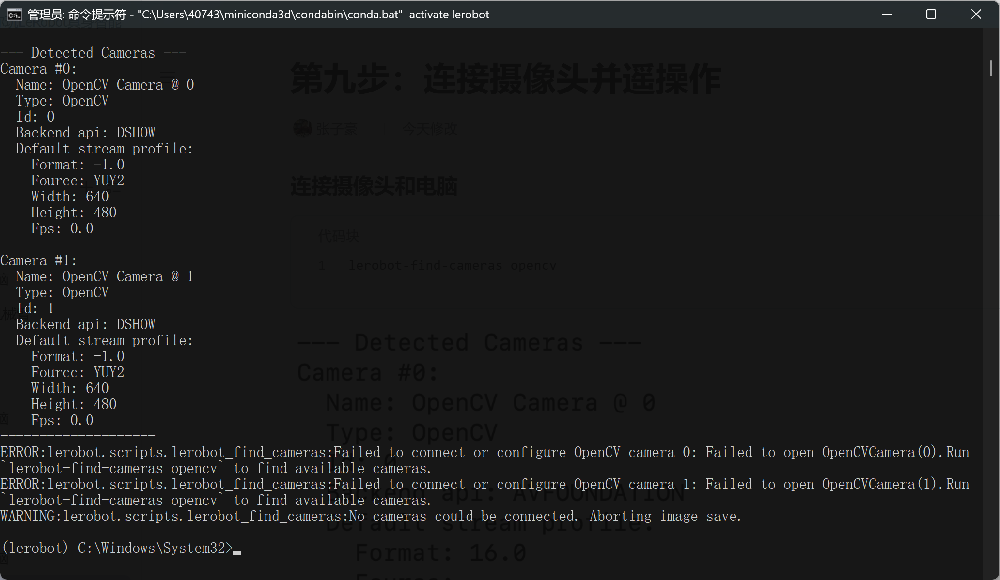
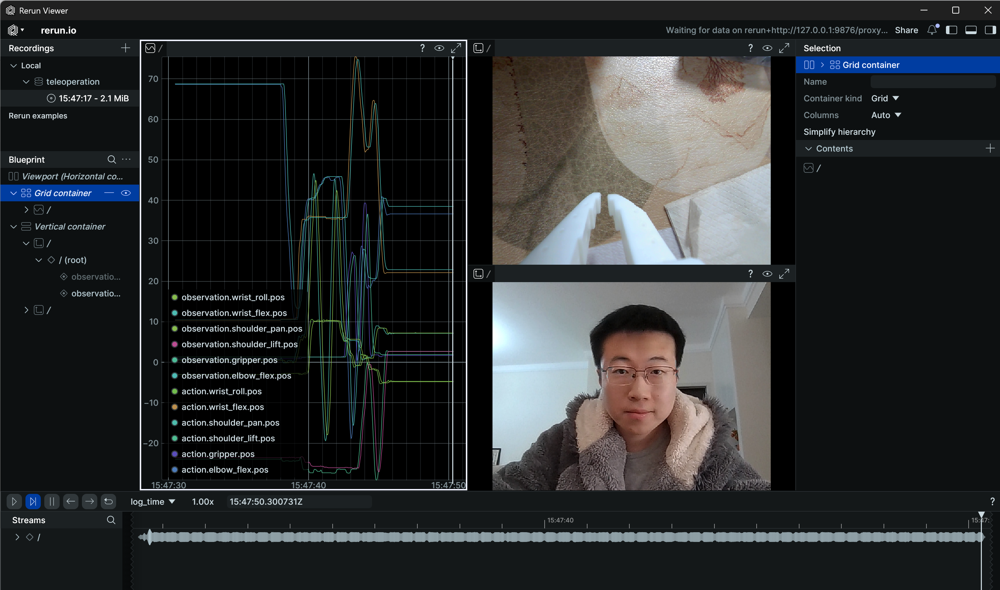

[English](../../en/05-teleoperation-with-camera/windows.md) | [简体中文](../../zh-hans/05-teleoperation-with-camera/windows.md) | 繁體中文 | [Deutsch](../../de/05-teleoperation-with-camera/windows.md) | [Español](../../es/05-teleoperation-with-camera/windows.md) | [Français](../../fr/05-teleoperation-with-camera/windows.md) | [Italiano](../../it/05-teleoperation-with-camera/windows.md) | [日本語](../../ja/05-teleoperation-with-camera/windows.md) | [한국어](../../ko/05-teleoperation-with-camera/windows.md) | [Português (BR)](../../pt-br/05-teleoperation-with-camera/windows.md) | [Português (PT)](../../pt-pt/05-teleoperation-with-camera/windows.md)

# Windows電腦

## 連接攝影機和電腦

```Shell
lerobot-find-cameras opencv
```


## 遠端操作並顯示攝影機畫面

```Shell
lerobot-teleoperate --robot.type=so101_follower --robot.port=COM6 --robot.id=my_follower_arm --robot.cameras="{ front: {type: opencv, index_or_path: 1, width: 640, height: 480, fps: 60, fourcc: "MJPG"}}" --teleop.type=so101_leader --teleop.port=COM7 --teleop.id=my_leader_arm --display_data=true
```

會開啟rerun.io畫面，即時顯示各個伺服馬達關節的軌跡，以及攝影機即時畫面

並將影像儲存至`C:\Users\用户\outputs\captured_images`目錄


## 如果遇到了下面這種報錯

攝影機連接不上，但在騰訊會議中切換攝影機，仍然能正常開啟



修改`lerobot\src\lerobot\cameras\utils.py`檔案，將OpenCV後端改為`cv2.CAP_SHOW`


> 這是一個豆包都無法解決的bug，都怪lerobot程式庫封裝的太深了，初學者小白很難dubug

<figure view-type="Preview">[附件 / Attachment: wx_camera_1768139334330.mp4](../../en/images/wx_camera_1768139334330.mp4)</figure>

## 連接多個攝影機，遠端操作並顯示攝影機畫面

```Shell
lerobot-teleoperate --robot.type=so101_follower --robot.port=COM6 --robot.id=my_follower_arm --robot.cameras="{ front: {type: opencv, index_or_path: 0, width: 640, height: 480, fps: 60, fourcc: "MJPG"}, side: {type: opencv, index_or_path: 1, width: 640, height: 480, fps: 60, fourcc: "MJPG"}}" --teleop.type=so101_leader --teleop.port=COM7 --teleop.id=my_leader_arm --display_data=true
```


