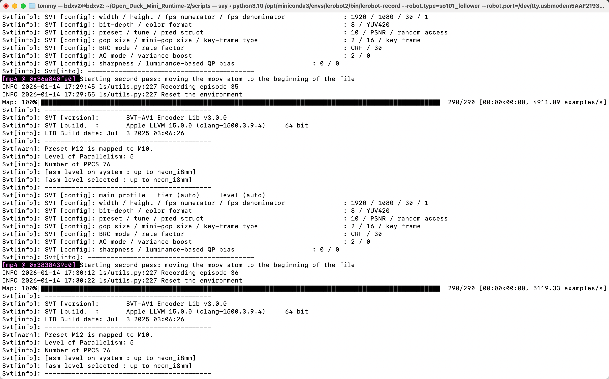
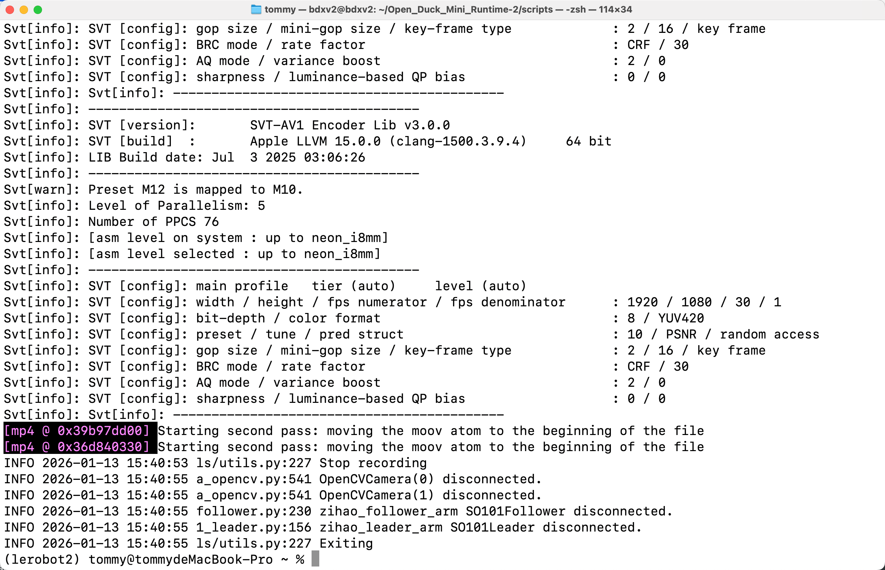

[English](../../en/06-collect-dataset-real/collect-dataset.md) | [简体中文](../../zh-hans/06-collect-dataset-real/collect-dataset.md) | 繁體中文 | [Deutsch](../../de/06-collect-dataset-real/collect-dataset.md) | [Español](../../es/06-collect-dataset-real/collect-dataset.md) | [Français](../../fr/06-collect-dataset-real/collect-dataset.md) | [Italiano](../../it/06-collect-dataset-real/collect-dataset.md) | [日本語](../../ja/06-collect-dataset-real/collect-dataset.md) | [한국어](../../ko/06-collect-dataset-real/collect-dataset.md) | [Português (BR)](../../pt-br/06-collect-dataset-real/collect-dataset.md) | [Português (PT)](../../pt-pt/06-collect-dataset-real/collect-dataset.md)

# 示教採集資料集

## 刪除之前已經有的同名資料集（如果有）

```Shell
sudo rm -rf /Users/tommy/.cache/huggingface/lerobot/Tommymy/lerobot_my_dataset_a
```

## 一個攝影機，採集資料集-Mac電腦

```Shell
lerobot-record \
    --robot.type=so101_follower \
    --robot.port=/dev/tty.usbmodem5AAF2193061 \
    --robot.id=my_follower_arm \
    --robot.cameras="{ front: {type: opencv, index_or_path: 0, width: 1920, height: 1080, fps: 60, fourcc: "MJPG"}}" \
    --teleop.type=so101_leader \
    --teleop.port=/dev/tty.usbmodem5AAF2194741 \
    --teleop.id=my_leader_arm \
    --display_data=true \
    --dataset.repo_id=Tommymy/lerobot_my_dataset_a \
    --dataset.num_episodes=40 \
    --dataset.single_task="Grab Oranges" \
    --dataset.push_to_hub=false \
    --dataset.episode_time_s=10 \
    --dataset.reset_time_s=2
```

## 兩個攝影機，採集資料集-Mac電腦

```Shell
lerobot-record \
    --robot.type=so101_follower \
    --robot.port=/dev/tty.usbmodem5AAF2193061 \
    --robot.id=my_follower_arm \
    --robot.cameras="{ front: {type: opencv, index_or_path: 0, width: 1920, height: 1080, fps: 60, fourcc: "MJPG"}, side: {type: opencv, index_or_path: 1, width: 1920, height: 1080, fps: 30, fourcc: "MJPG"}}" \
    --teleop.type=so101_leader \
    --teleop.port=/dev/tty.usbmodem5AAF2194741 \
    --teleop.id=my_leader_arm \
    --display_data=true \
    --dataset.repo_id=Tommymy/lerobot_my_dataset_a \
    --dataset.num_episodes=40 \
    --dataset.single_task="Grab Oranges" \
    --dataset.push_to_hub=true \
    --dataset.episode_time_s=10 \
    --dataset.reset_time_s=2
```

## 採集中

<grid>
<column width-ratio="0.508765">

</column>
<column width-ratio="0.491235">

</column>
</grid>

鍵盤方向鍵操作：  
→（右箭頭）提前終止目前episode；進入下一個episode。  
←（左箭頭）取消目前episode；重新錄製。  
ESC，立即停止，編碼影片，並上傳資料集。

## 採集完畢，資料集儲存目錄

```Shell
/Users/tommy/.cache/huggingface/lerobot/Tommymy/lerobot_my_dataset_a
```


## 握手

```Shell
lerobot-record \
    --robot.type=so101_follower \
    --robot.port=/dev/tty.usbmodem5AAF2193061 \
    --robot.id=my_follower_arm \
    --robot.cameras="{ front: {type: opencv, index_or_path: 0, width: 1920, height: 1080, fps: 60, fourcc: "MJPG"}}" \
    --teleop.type=so101_leader \
    --teleop.port=/dev/tty.usbmodem5AAF2194741 \
    --teleop.id=my_leader_arm \
    --display_data=true \
    --dataset.repo_id=Tommymy/lerobot_my_dataset_shake_hands \
    --dataset.num_episodes=30 \
    --dataset.single_task="Shanke Hands" \
    --dataset.push_to_hub=false \
    --dataset.episode_time_s=12 \
    --dataset.reset_time_s=1
```
