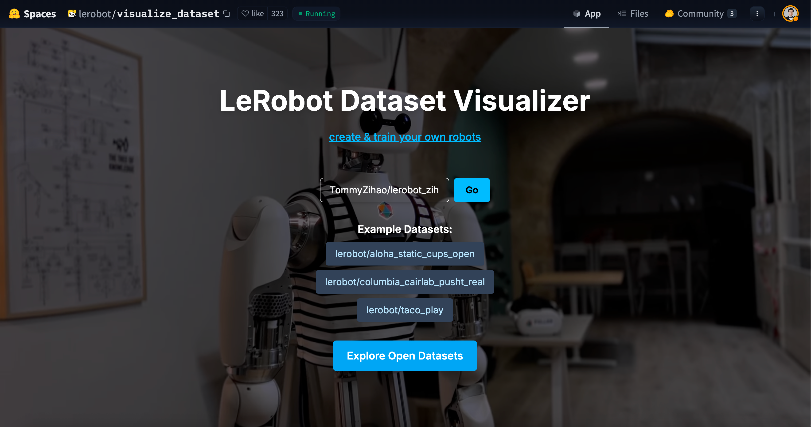
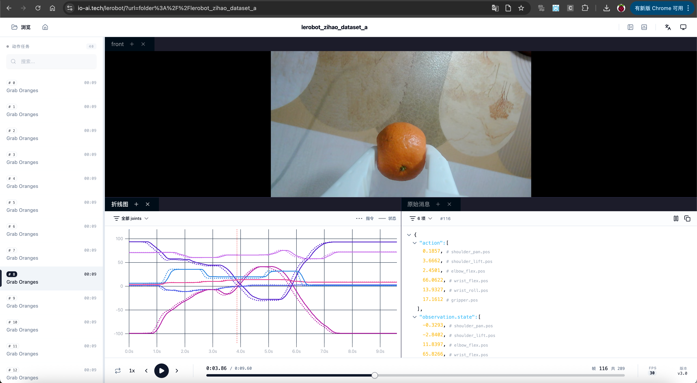
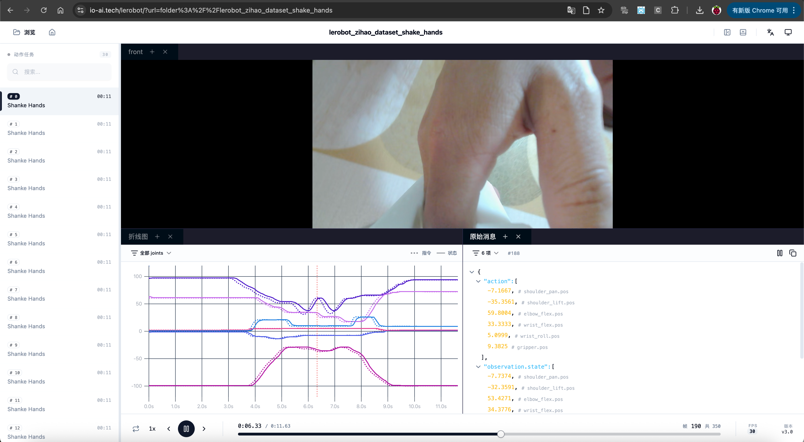
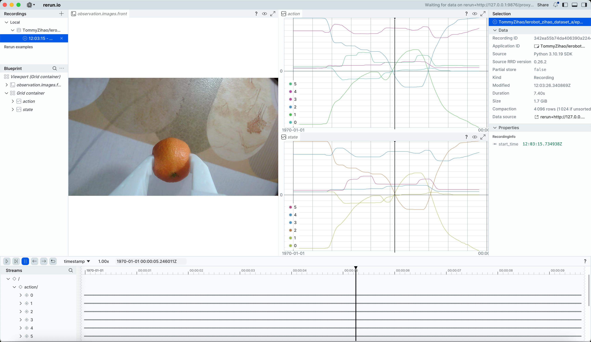

[English](../../en/06-collect-dataset-real/replay-dataset.md) | [简体中文](../../zh-hans/06-collect-dataset-real/replay-dataset.md) | 繁體中文 | [Deutsch](../../de/06-collect-dataset-real/replay-dataset.md) | [Español](../../es/06-collect-dataset-real/replay-dataset.md) | [Français](../../fr/06-collect-dataset-real/replay-dataset.md) | [Italiano](../../it/06-collect-dataset-real/replay-dataset.md) | [日本語](../../ja/06-collect-dataset-real/replay-dataset.md) | [한국어](../../ko/06-collect-dataset-real/replay-dataset.md) | [Português (BR)](../../pt-br/06-collect-dataset-real/replay-dataset.md) | [Português (PT)](../../pt-pt/06-collect-dataset-real/replay-dataset.md)

# 回看、回放資料集

## 視覺化整個資料集

https://huggingface.co/spaces/lerobot/visualize_dataset

http://io-ai.tech/lerobot

https://open.platform.io-ai.tech

輸入`TommyZihao/lerobot_zihao_dataset_a`，或者其他資料集




<grid>
<column width-ratio="0.500000">

</column>
<column width-ratio="0.500000">

</column>
</grid>

觀察：指令和狀態是不一致的，指令由主動臂Leader提供，狀態由從動臂Follower提供

## 視覺化檢視指定episode

```Shell
lerobot-dataset-viz --repo-id TommyZihao/lerobot_zihao_dataset_a --episode-index=2
```



拖曳時間軸檢視任意時刻的攝影機畫面和伺服馬達位置

## 回放指定episode從動臂動作

```Shell
lerobot-replay \
    --robot.type=so101_follower \
    --robot.port=/dev/tty.usbmodem5AAF2193061 \
    --robot.id=my_follower_arm \
    --dataset.repo_id=Tommymy/lerobot_my_dataset_a \
    --dataset.episode=2
```

能聽到聲音`Replaying episode`，然後從動臂移動，回放重現指定episode的動作

其實到這裡，已經能唬住很多外行了，不是嗎

<figure view-type="Preview">[附件 / Attachment: VID_20260115_140050.mp4](../../en/images/VID_20260115_140050.mp4)</figure>
