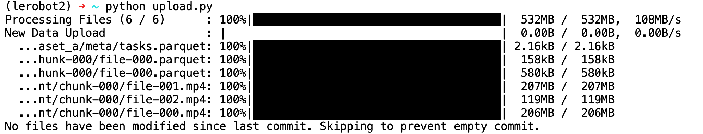

[English](../../en/06-collect-dataset-real/upload-dataset-to-huggingface.md) | [简体中文](../../zh-hans/06-collect-dataset-real/upload-dataset-to-huggingface.md) | 繁體中文 | [Deutsch](../../de/06-collect-dataset-real/upload-dataset-to-huggingface.md) | [Español](../../es/06-collect-dataset-real/upload-dataset-to-huggingface.md) | [Français](../../fr/06-collect-dataset-real/upload-dataset-to-huggingface.md) | [Italiano](../../it/06-collect-dataset-real/upload-dataset-to-huggingface.md) | [日本語](../../ja/06-collect-dataset-real/upload-dataset-to-huggingface.md) | [한국어](../../ko/06-collect-dataset-real/upload-dataset-to-huggingface.md) | [Português (BR)](../../pt-br/06-collect-dataset-real/upload-dataset-to-huggingface.md) | [Português (PT)](../../pt-pt/06-collect-dataset-real/upload-dataset-to-huggingface.md)

<title>上傳資料集到HuggingFace（選用）</title>

# 方法一：本機上傳（不建議，上傳網速慢）

- 自動上傳

在採集資料集時設定`push_to_hub=true`，採集完畢後自動上傳


- 手動上傳

在採集資料集時設定`push_to_hub=false`，採集完畢後手動上傳

```Shell
hf upload Tommymy/lerobot_my_dataset_a /Users/tommy/.cache/huggingface/lerobot/Tommymy/lerobot_my_dataset_a / --repo-type=dataset
```


無論自動上傳還是手動上傳，上傳速度都很慢（每秒鐘一百KB）

因為HuggingFace伺服器在國外

# 方法二：雲GPU平台上傳（建議）

## 登入雲GPU平台Featurize

https://featurize.cn?s=d7ce99f842414bfcaea5662a97581bd1

## 開啟一個雲GPU執行個體

## 上傳資料集壓縮檔到`資料集`

## 複製執行個體下載命令


## 在雲GPU執行個體的命令列中執行

```Shell
pip install httpx

unzip your_datasets.zip

hf auth login
```

## 上傳資料集到HuggingFace

建立`upload_dataset.py`檔案，內容如下

```Python
from huggingface_hub import HfApi

api = HfApi()

api.upload_folder(
    folder_path="~/lerobot_my_dataset_a",
    repo_id="Tommymy/lerobot_my_dataset_a",
    repo_type="dataset"
)

api.create_tag("Tommymy/lerobot_my_dataset_a", tag="v0.4.0", repo_type="dataset")
```

執行檔案

```Shell
python upload_dataset.py
```



- 另一種上傳方法（不建議）

```Shell
hf upload Tommymy/lerobot_my_dataset_a lerobot_my_dataset_a / --repo-type=dataset
```


# 檢視HuggingFace上的資料集

https://huggingface.co/datasets/Juxi-Technology/soarm_amazing_hand_pick


