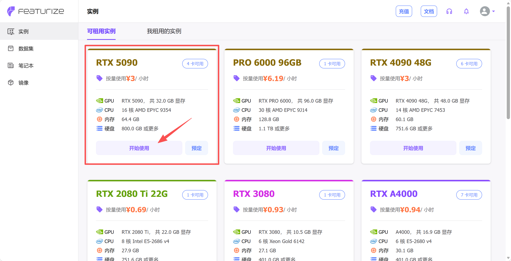
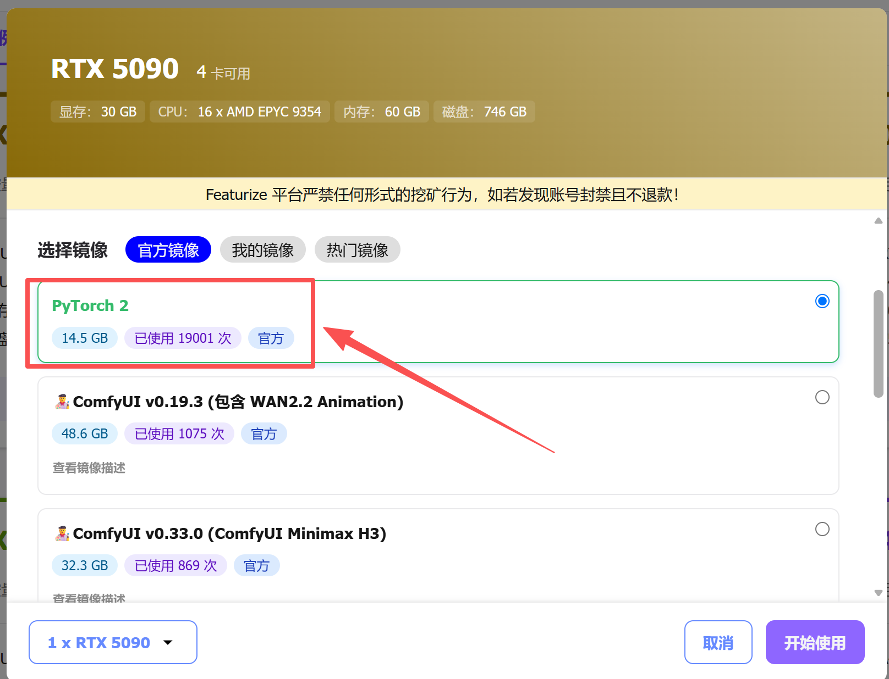
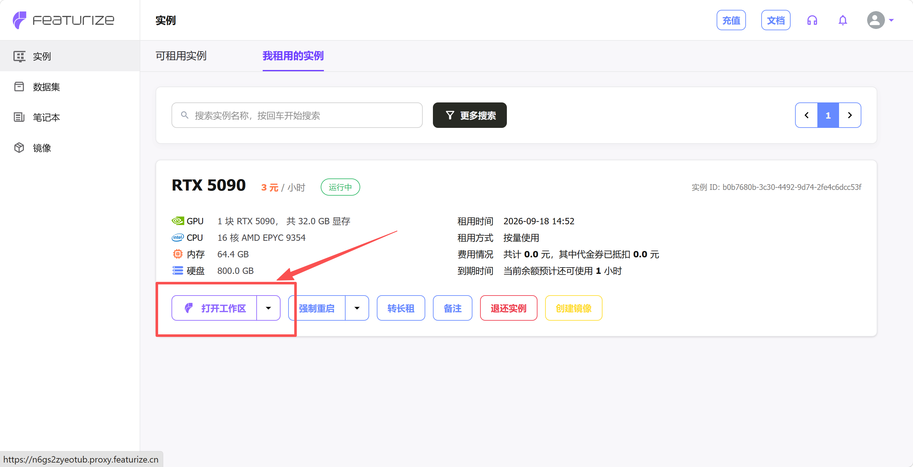

[English](../../en/08-train-model/cloud-gpu-setup.md) | [简体中文](../../zh-hans/08-train-model/cloud-gpu-setup.md) | 繁體中文 | [Deutsch](../../de/08-train-model/cloud-gpu-setup.md) | [Español](../../es/08-train-model/cloud-gpu-setup.md) | [Français](../../fr/08-train-model/cloud-gpu-setup.md) | [Italiano](../../it/08-train-model/cloud-gpu-setup.md) | [日本語](../../ja/08-train-model/cloud-gpu-setup.md) | [한국어](../../ko/08-train-model/cloud-gpu-setup.md) | [Português (BR)](../../pt-br/08-train-model/cloud-gpu-setup.md) | [Português (PT)](../../pt-pt/08-train-model/cloud-gpu-setup.md)

# 雲GPU訓練環境設定

## 關閉自己電腦的網路代理

不然可能打不開Jupyter的命令列

## 登入雲GPU平台Featurize

https://featurize.cn?s=d7ce99f842414bfcaea5662a97581bd1

## 開啟一個雲GPU實例

<grid>
<column width-ratio="0.597692">

</column>
<column width-ratio="0.402308">

</column>
</grid>




> 點擊下方的「JupyterLab」，左上角有個上傳按鈕，可以在這裡上傳程式碼和資料集

## 安裝設定環境

```Shell
conda create -y -n lerobot python=3.12
conda activate lerobot
conda install ffmpeg=7.1.1 -c conda-forge -y
# git clone https://github.com/Seeed-Projects/lerobot.git ~/work/Lerobot
git clone https://github.com/huggingface/lerobot.git
cd lerobot
pip install -e ".[pi]"
pip install wandb --upgrade
# export HF_ENDPOINT=https://hf-mirror.com
hf auth login

# 不上传到Huggingface和不需要wandb则不用安装
```

> 如果在模型安裝的時候缺少了training，需要額外安裝一下
> 
> `pip install -e ".[training]"`

## 登入wandb

```Shell
wandb login
复制粘贴API Key，回车
```


## 掛載資料集

```Shell
复制实例下载命令，类似：
featurize dataset download 7f40bdaa-b1a4-4c00-9652-ff26fd079109

unzip lerobot_zihao_dataset_shake_hands.zip
```

資料集出現在`~`目錄下

## 修改權重儲存頻率（選做）

開啟`lerobot/src/lerobot/configs/train.py`

將save_freq，從20_000修改為5_000

這樣能在訓練更早期取得模型權重檔案
