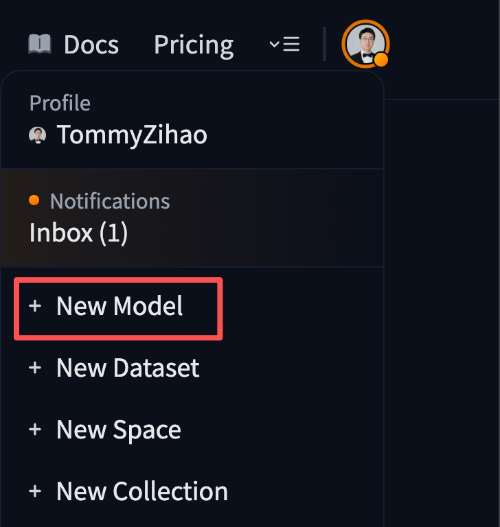
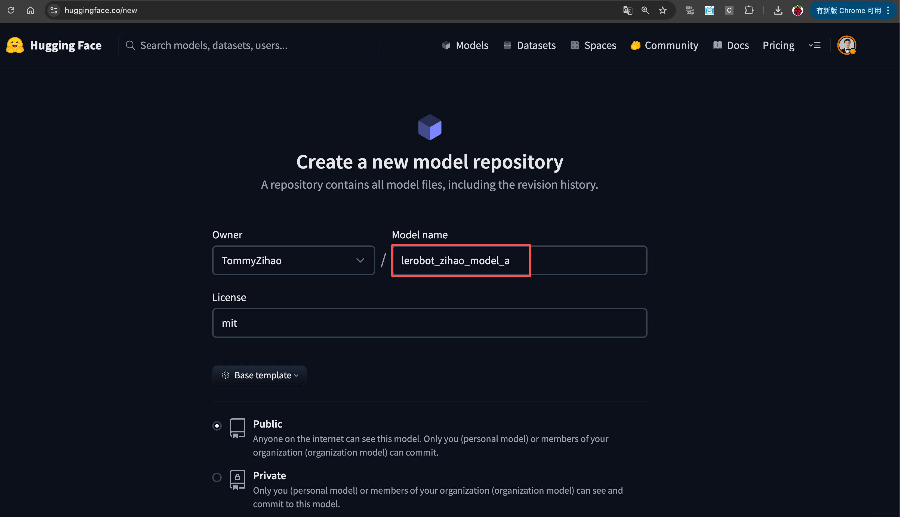
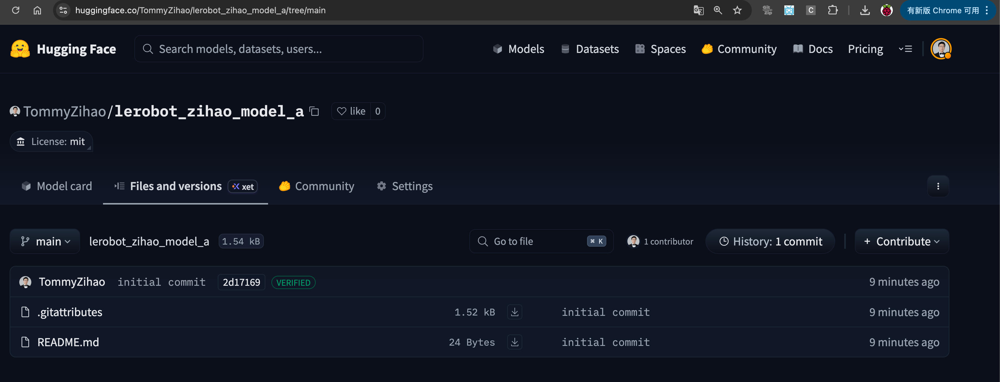

[English](../../en/08-train-model/upload-model-to-huggingface.md) | [简体中文](../../zh-hans/08-train-model/upload-model-to-huggingface.md) | 繁體中文 | [Deutsch](../../de/08-train-model/upload-model-to-huggingface.md) | [Español](../../es/08-train-model/upload-model-to-huggingface.md) | [Français](../../fr/08-train-model/upload-model-to-huggingface.md) | [Italiano](../../it/08-train-model/upload-model-to-huggingface.md) | [日本語](../../ja/08-train-model/upload-model-to-huggingface.md) | [한국어](../../ko/08-train-model/upload-model-to-huggingface.md) | [Português (BR)](../../pt-br/08-train-model/upload-model-to-huggingface.md) | [Português (PT)](../../pt-pt/08-train-model/upload-model-to-huggingface.md)

# 上傳模型到HuggingFace（可選）

## 建立模型Repo

<grid>
<column width-ratio="0.354197">

</column>
<column width-ratio="0.645803">

</column>
</grid>

## 查看模型Repo

https://huggingface.co/TommyZihao/lerobot_zihao_model_a

現在是空的




## 上傳模型

建立`upload_model.py`檔案，內容如下

```Python
from huggingface_hub import HfApi

api = HfApi()

repo_id = "TommyZihao/lerobot_zihao_model_shake_hands"

api.upload_folder(
    folder_path="~/output_lerobot_train/b/checkpoints/last/pretrained_model",
    repo_id=repo_id,
    repo_type="model"
)

api.create_tag(repo_id, tag="v0.1.0", repo_type="model")
```

執行

```Shell
python upload_model.py
```


## 查看模型Repo

https://huggingface.co/TommyZihao/lerobot_zihao_model_a


現在有了模型檔案
