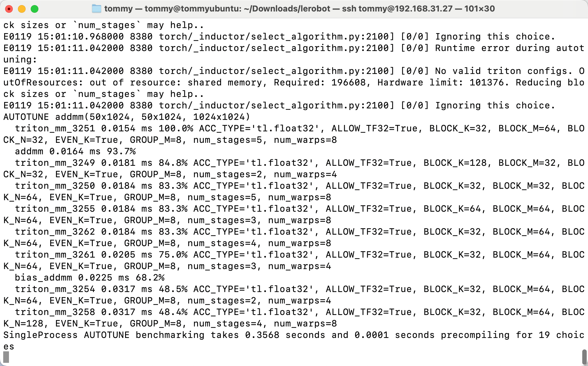
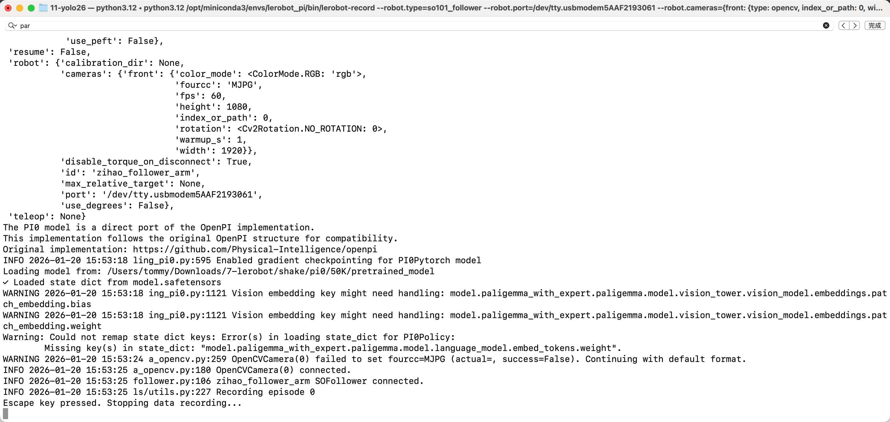

[English](../../en/09-inference/infer-pi0.md) | [简体中文](../../zh-hans/09-inference/infer-pi0.md) | 繁體中文 | [Deutsch](../../de/09-inference/infer-pi0.md) | [Español](../../es/09-inference/infer-pi0.md) | [Français](../../fr/09-inference/infer-pi0.md) | [Italiano](../../it/09-inference/infer-pi0.md) | [日本語](../../ja/09-inference/infer-pi0.md) | [한국어](../../ko/09-inference/infer-pi0.md) | [Português (BR)](../../pt-br/09-inference/infer-pi0.md) | [Português (PT)](../../pt-pt/09-inference/infer-pi0.md)

# 推論命令列-pi0

## Ubuntu

- 刪除原有的eval開頭的資料集（如有）

```Shell
sudo chmod 666 /dev/ttyACM*
sudo rm -rf /home/tommy/.cache/huggingface/lerobot/Tommymy/eval_lerobot_my_dataset_shake_hands
export TOKENIZERS_PARALLELISM=false
```

- 推論命令列

```Shell
lerobot-record  \
  --robot.type=so101_follower \
  --robot.port=/dev/ttyACM0 \
  --robot.cameras="{ front: {type: opencv, index_or_path: 0, width: 640, height: 480, fps: 60, fourcc: "MJPG"}}" \
  --robot.id=my_follower_arm \
  --display_data=false \
  --dataset.repo_id=Tommymy/eval_lerobot_my_dataset_shake_hands \
  --dataset.single_task="Shake Hands" \
  --dataset.episode_time_s=1000 \
  --dataset.push_to_hub=false \
  --policy.path=/home/tommy/Downloads/lerobot_output/shake/pi0/50K/pretrained_model
```

<grid>
<column width-ratio="0.494604">

</column>
<column width-ratio="0.505396">

</column>
</grid>


> **影片待補**：原文此處嵌有 `VID_20260120_182109.mp4`（原始 310MB）。飛書側該檔案未提供可下載的影片串流，只有中繼資料，因此未能抓取。需查看請到[原文件](https://juxitech.feishu.cn/wiki/NOWXw9NOJiDTs2kRr7RcdIrKnvg)。


## Mac

- 刪除原有的eval開頭的資料集（如有）

```Shell
sudo rm -rf /Users/tommy/.cache/huggingface/lerobot/Tommymy/eval_lerobot_my_dataset_shake_hands
```

- 推論命令列

```Shell
lerobot-record  \
  --robot.type=so101_follower \
  --robot.port=/dev/tty.usbmodem5AAF2193061 \
  --robot.cameras="{front: {type: opencv, index_or_path: 0, width: 1920, height: 1080, fps: 60, fourcc: "MJPG"}}" \
  --robot.id=my_follower_arm \
  --policy.freeze_vision_encoder=false \
  --policy.dtype=bfloat16 \
  --policy.compile_model=true \
  --display_data=false \
  --dataset.repo_id=Tommymy/eval_lerobot_my_dataset_shake_hands \
  --dataset.single_task="Shake Hands" \
  --dataset.episode_time_s=1000 \
  --dataset.push_to_hub=false \
  --policy.device=cpu \
  --policy.path=/Users/tommy/Downloads/7-lerobot/shake/pi0/50K/pretrained_model
```

<grid>
<column width-ratio="0.465817">

</column>
<column width-ratio="0.534183">

</column>
</grid>

## 用Mac推論，機械臂一頓一頓的原因

- 資料集太小了
- 顯示卡顯示記憶體不夠，需要上50系顯示卡
