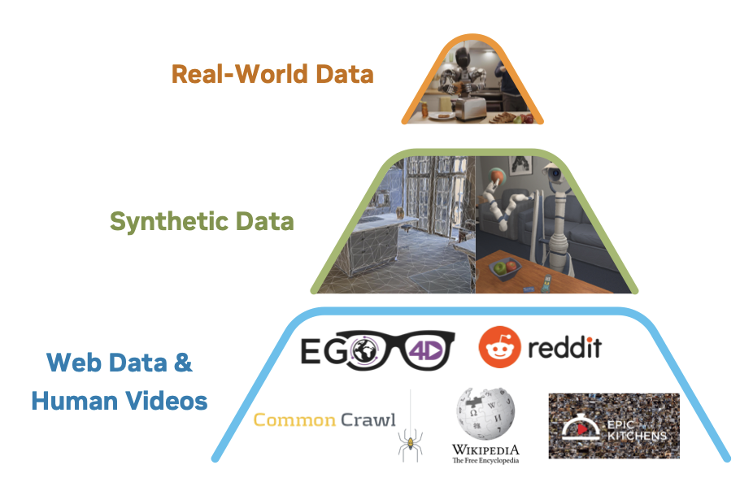

[English](../../en/basics/lerobot-datasets-on-huggingface.md) | [简体中文](../../zh-hans/basics/lerobot-datasets-on-huggingface.md) | 繁體中文 | [Deutsch](../../de/basics/lerobot-datasets-on-huggingface.md) | [Español](../../es/basics/lerobot-datasets-on-huggingface.md) | [Français](../../fr/basics/lerobot-datasets-on-huggingface.md) | [Italiano](../../it/basics/lerobot-datasets-on-huggingface.md) | [日本語](../../ja/basics/lerobot-datasets-on-huggingface.md) | [한국어](../../ko/basics/lerobot-datasets-on-huggingface.md) | [Português (BR)](../../pt-br/basics/lerobot-datasets-on-huggingface.md) | [Português (PT)](../../pt-pt/basics/lerobot-datasets-on-huggingface.md)

# HuggingFace上的LeRobot資料集

## LeRobot格式的開源資料集

https://huggingface.co/blog/lerobot-datasets#what-makes-a-good-dataset

## 幾個有意思的LeRobot資料集

篩選不同顏色的糖果豆

https://huggingface.co/spaces/lerobot/visualize_dataset?path=%2FMarkusWuenstel%2Fso101-sort-color-joint-angles-preprocessed%2Fepisode_0

把樂高積木放到盒子裡

https://huggingface.co/spaces/lerobot/visualize_dataset?path=%2Flerobot%2Fsvla_so101_pickplace%2Fepisode_0

整理桌面

https://huggingface.co/spaces/lerobot/visualize_dataset?path=%2Fyouliangtan%2Fso101-table-cleanup%2Fepisode_0

推積木

https://huggingface.co/spaces/lerobot/visualize_dataset?path=%2FIPEC-COMMUNITY%2Flanguage_table_lerobot%2Fepisode_17

把T形零件擺到正確位置（模擬資料）

https://huggingface.co/spaces/lerobot/visualize_dataset?path=%2Flerobot%2Fpusht%2Fepisode_15

關抽屜

https://huggingface.co/spaces/lerobot/visualize_dataset?path=%2Flirislab%2Fclose_top_drawer_teabox%2Fepisode_1

國際象棋比賽，把棋子放到高亮格子上

https://huggingface.co/spaces/lerobot/visualize_dataset?path=%2FChojins%2Fchess_game_001_blue_stereo%2Fepisode_1

擺放動物積木

https://huggingface.co/spaces/lerobot/visualize_dataset?path=%2Fpierfabre%2Fchicken%2Fepisode_6

各種家務

https://huggingface.co/spaces/lerobot/visualize_dataset?path=%2Fcadene%2Fdroid_1.0.1%2Fepisode_13