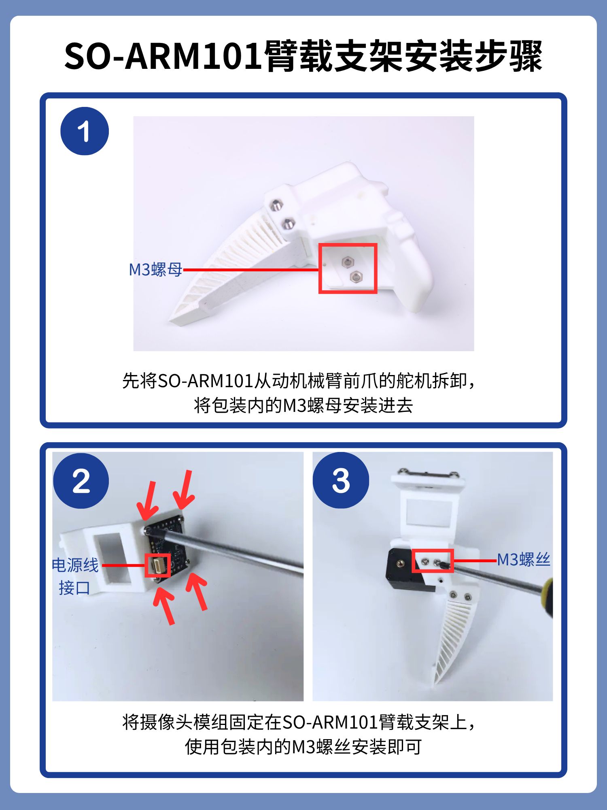
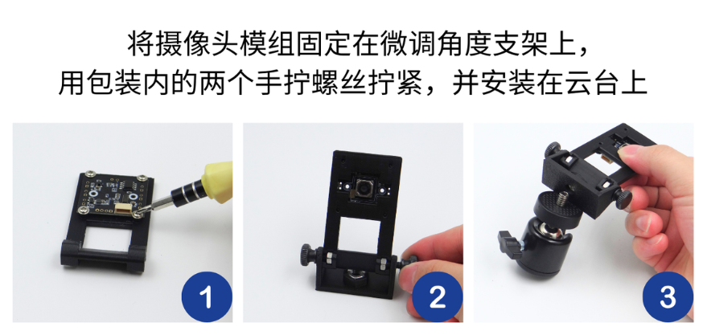
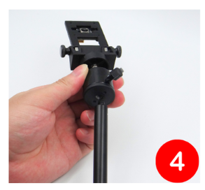
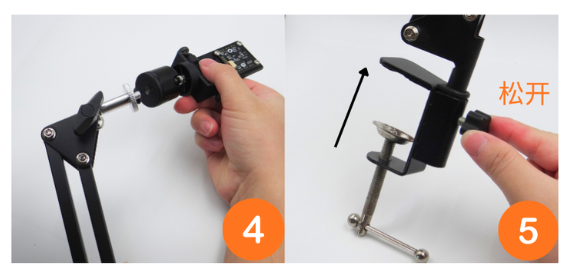

[English](../../en/so-arm101-assembly/arm-mount-and-camera-kit.md) | [简体中文](../../zh-hans/so-arm101-assembly/arm-mount-and-camera-kit.md) | 繁體中文 | [Deutsch](../../de/so-arm101-assembly/arm-mount-and-camera-kit.md) | [Español](../../es/so-arm101-assembly/arm-mount-and-camera-kit.md) | [Français](../../fr/so-arm101-assembly/arm-mount-and-camera-kit.md) | [Italiano](../../it/so-arm101-assembly/arm-mount-and-camera-kit.md) | [日本語](../../ja/so-arm101-assembly/arm-mount-and-camera-kit.md) | [한국어](../../ko/so-arm101-assembly/arm-mount-and-camera-kit.md) | [Português (BR)](../../pt-br/so-arm101-assembly/arm-mount-and-camera-kit.md) | [Português (PT)](../../pt-pt/so-arm101-assembly/arm-mount-and-camera-kit.md)

# SO-ARM100&101臂載支架和環境相機套件 安裝教學

USB自動對接攝影機除錯請參考該教學<cite doc-id="JXstdNbN6oiL1WxiqJrc2OJDnrf" file-type="docx" title="USB自動對焦攝影機教學" type="doc"></cite>

## SO-ARM101臂載支架安裝步驟

成品 一般夾爪裡已裝好螺母，可以直接跳到步驟2

## 環境相機套件支架安裝步驟

1.先固定微調角度支架

2.側視環境相機套件

3.頂視環境相機套件

## 橡膠防滑墊，自行裁剪

