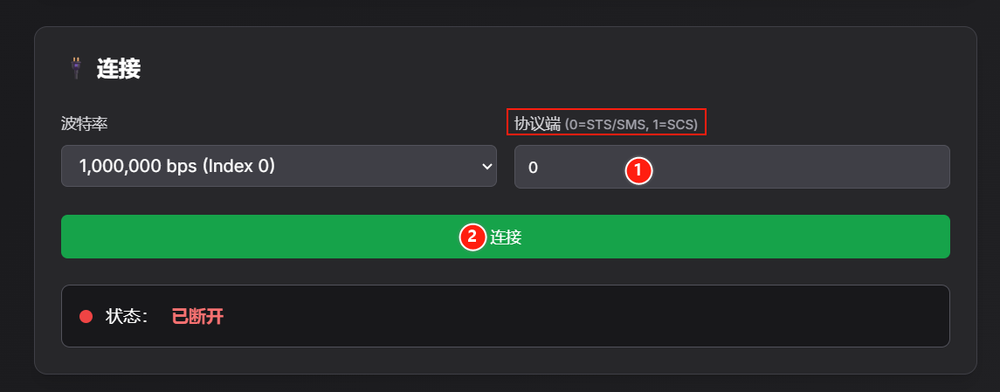

[English](../en/urdf-and-resources.md) | [简体中文](../zh-hans/urdf-and-resources.md) | 繁體中文 | [Deutsch](../de/urdf-and-resources.md) | [Español](../es/urdf-and-resources.md) | [Français](../fr/urdf-and-resources.md) | [Italiano](../it/urdf-and-resources.md) | [日本語](../ja/urdf-and-resources.md) | [한국어](../ko/urdf-and-resources.md) | [Português (BR)](../pt-br/urdf-and-resources.md) | [Português (PT)](../pt-pt/urdf-and-resources.md)

<title>URDF檔案及資料參考</title>

# Lerbot官方的[URDF檔案](https://github.com/TheRobotStudio/SO-ARM100/blob/main/Simulation/SO101/so101_new_calib.urdf)

## URDF Studio

https://urdf.d-robotics.cc/

## ROS2 模擬控制（可自行實現）

https://github.com/holmsslk/so-arm-moveit-hardware

## LeRobot的官方圖形介面

https://github.com/huggingface/leLab

LeLab是一款網頁應用程式，它將 LeRobot 的全部工作流程——校正、遠端操控、記錄、訓練、回放——整合到一個瀏覽器介面中。只需連接機械手臂，開啟應用程式，即可開始操作。無需繁瑣的命令列操作，也無需鍵盤輸入。

🤗 LeRobot 的原生網頁入口，旨在讓新使用者在幾分鐘內完成從「開箱」到「訓練他們的第一個保單」的整個過程。

🤗 只需一條命令即可安裝並執行所有程式。

# 手機控制從動臂

https://huggingface.co/docs/lerobot/main/en/phone_teleop

## 雲端機器人研發：基於 AWS 實現 ROS 2 裝置與 Isaac Sim 的 Lerobot 模擬及資料流

https://github.com/ti/ti.github.io/blob/95261efa4f8bdb4c8571920762318a532e58c7fd/%E5%BC%80%E5%8F%91/isaac/aws-ros2-isaac.md

## 網頁端設定伺服馬達ID和中位校正

https://bambot.org/feetech.js?lang=zh

1、根據伺服馬達型號輸入0或1，點擊「連接」

2、掃描ID 1\~6 的伺服馬達，可以根據掃描結果裡的FOUND確認對應ID伺服馬達。例如圖片裡伺服馬達 ID 1 被掃描到了

![圖片展示的是Lerbot官方URDF Studio中掃描伺服馬達介面。介面顯示起始ID為1，結束ID為6，下方有「開始掃描」按鈕。掃描結果部分，掃描ID1時，掃描到ID1239，其餘掃描ID2至ID6均提示「ERROR: Exception reading position from servo 2: \[TxRxResult\] There is no status packet!，Error code: 0」。該圖片與上下文介紹的Lerbot官方URDF Studio中掃描伺服馬達操作相關，直觀呈現了掃描過程及結果。](../en/images/fix-01.png)

3、ID設定和中位校正

①目前伺服馬達ID輸入為被掃描到的伺服馬達ID

②在「ID管理」中輸入數字，點擊「更改ID」即可設定ID

③中位校正（STS3215伺服馬達中位是2047，SCS0009伺服馬達中位是511）

STS伺服馬達：在「位置控制」輸入2047，並點擊「Set」

SCS伺服馬達：在「位置控制」輸入511，並點擊「Set」

